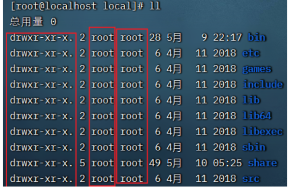

# Linux基础命令

ctrl + c 强制停止

ctrl + d 退出或登出

ctrl + l clear 清空终端内容

history

!命令前缀，自动执行上一次匹配前缀的命令

光标移动快捷键

```
ctrl + a，跳到命令开头
ctrl + e，跳到命令结尾
ctrl + 键盘左键，向左跳一个单词
ctrl + 键盘右键，向右跳一个单词
```


## Linux的目录结构


- `/`，根目录是最顶级的目录了
- Linux只有一个顶级目录：`/`
- 路径描述的层次关系同样适用`/`来表示
- /home/itheima/a.txt，表示根目录下的home文件夹内有itheima文件夹，内有a.txt


## ls命令

ls 列出文件夹信息

`ls [-l -h -a] [参数]`

- ls -l  ll 以列表形式查看
- ll -h 显示kb
- ll -a，显示隐藏文件(.开头的文件/文件夹)
- ll -t 时间
- ll -r 逆序
- ls -F 分类显示


## pwd命令

pwd print work directory


## cd命令

cd change directory

cd ~ 用户目录

cd ./ 当前 	cd ..上一级

## HOME目录

每一个用户在Linux系统中都有自己的专属工作目录，称之为HOME目录。

- 普通用户的HOME目录，默认在：`/home/用户名`

- root用户的HOME目录，在：`/root`


FinalShell登陆终端后，默认的工作目录就是用户的HOME目录


## 相对路径、绝对路径

- 相对路径，非`/`开头的称之为相对路径

  相对路径表示以**当前目录**作为起点，去描述路径，

  如`test/a.txt`，表示当前工作目录内的test文件夹内的a.txt文件

- 绝对路径，以`/`开头的称之为绝对路径

  绝对路径从`根`开始描述路径
  
  cd /etc/sysconfig/network-scripts/


## 特殊路径符

- `.`，当前 ./a.txt 当前文件夹内的`a.txt`文件
- `..`，上级目录 ../ 表示上级目录   ../../  上级的上级目录
- `~`，用户的HOME目录 `cd ~`切回用户HOME目录

## mkdir命令

功能：创建文件夹

语法：`mkdir [-p] 参数`

- 参数：被创建文件夹的路径
- 选项：-p，可选，表示创建前置路径   mkdir /a/b/c -p


## touch命令

功能：创建文件

语法：`touch 参数`

- 参数：被创建的文件路径


## cat命令

功能：查看文件内容

语法：`cat 参数`

- 参数：被查看的文件路径


## more命令

功能：查看文件，可以支持翻页查看

语法：`more 参数`

- 参数：被查看的文件路径
- 在查看过程中：
  - `空格`键翻页
  - `q`退出查看


## cp命令

功能：复制文件、文件夹

语法：`cp [-r] 参数1 参数2`

- 参数1，被复制的
- 参数2，要复制去的地方
- 选项：-r，可选，复制文件夹使用

示例：

- cp a.txt b.txt，复制当前目录下a.txt为b.txt
- cp a.txt test/，复制当前目录a.txt到test文件夹内
- cp -r test test2，复制文件夹test到当前文件夹内为test2存在


## mv命令

功能：移动文件、文件夹

语法：`mv 参数1 参数2`

- 参数1：被移动的
- 参数2：要移动去的地方，参数2如果不存在，则会进行改名


## rm命令

功能：删除文件、文件夹

语法：`rm [-r -f] 参数...参数`

- 参数：支持多个，每一个表示被删除的，空格进行分隔
- 选项：-r，删除文件夹使用
- 选项：-f，强制删除，不会给出确认提示，一般root用户会用到

> rm命令很危险，一定要注意，特别是切换到root用户的时候。


## which命令

功能：查看命令的程序本体**文件路径**

语法：`which 参数`

- 参数：被查看的命令 which ls


## find

功能：搜索文件

按文件名搜索

find 起始路径 -name 搜索关键字

关键字支持通配符， 比如：*test表示搜索任意以test结尾的文件

```sh
find / -name docker

find /usr/local -name  *bin*
```

## locate

**CentOS7默认没有安装该命令** 

```sh
yum install mlocate -y
```

locate通过数据库（/var/lib/mlocate/mlocate.db文件）来查找文件（当天新增的文件查询不到 使用sudo updatedb 可以立即更新数据库）


## grep命令

功能：过滤关键字

语法：`grep [-n] 关键字 文件路径`

- 选项-n，可选，表示在结果中显示匹配的行的行号。
- 参数，关键字，必填，表示过滤的关键字，带有空格或其它特殊符号，建议使用””将关键字包围起来
- 参数，文件路径，必填，表示要过滤内容的文件路径，可作为内容输入端口


> 参数文件路径，可以作为管道符的输入


## wc命令

功能：统计 word count

语法：`wc [-c -m -l -w] 文件路径`

- 选项，-c，统计bytes数量
- 选项，-m，统计字符数量
- 选项，-l，统计行数
- 选项，-w，统计单词数量
- 参数，文件路径，被统计的文件，可作为内容输入端口


> 参数文件路径，可作为管道符的输入


## 管道符|

写法：`|`

功能：将符号左边的结果，作为符号右边的输入

示例：

`cat a.txt | grep itheima`，将cat a.txt的结果，作为grep命令的输入，用来过滤`itheima`关键字


可以支持嵌套：

`cat a.txt | grep itheima | grep itcast`


## echo命令

功能：输出内容

语法：`echo 参数`

- 参数：被输出的内容

echo haha 	echo $var

## 反引号

功能：被两个反引号包围的内容，会作为命令执行

示例：

- echo \`pwd\`，会输出当前工作目录


## tail命令

功能：查看文件尾部内容

语法：`tail [-f] 参数`

- 参数：被查看的文件
- 选项：-f，持续跟踪文件修改

tail -f docker.log

## head命令

功能：查看文件头部内容

语法：`head [-n] 参数`

- 参数：被查看的文件
- 选项：-n，查看的行数

head -3 docker.log

## 重定向符

功能：将符号左边的结果，输出到右边指定的文件中去

- `>`，表示覆盖输出
- `>>`，表示追加输出


## vi编辑器

### 命令模式快捷键


### 底线命令快捷键


### 查看命令的帮助 ls --help

可以通过：`命令 --help`查看命令的帮助手册


### 查看命令的详细手册 man ls

可以通过：`man 命令`查看某命令的详细手册


# Linux常用操作

## 软件安装

- CentOS系统使用：
  - yum [install remove search] [-y] 软件名称
    - install 
    - remove 
    - search 
    - -y，自动确认
- Ubuntu系统使用
  - apt [install remove search] [-y] 软件名称
    - install 
    - remove 
    - search 
    - -y，自动确认

> yum 和 apt 均需要root权限


## systemctl

功能：控制 系统服务的 启动关闭等

语法：`systemctl start | stop | restart | disable | enable | status 服务名`

- start
- stop
- status
- disable 关闭开机自启
- enable 开启开机自启
- restart

系统内置的服务比较多，比如：

```sh
NetworkManager 主网络服务
network 	   副网络服务
firewalld      防火墙服务
sshd，ssh服务（FinalShell远程登录Linux使用的就是这个服务）
```


## 软链接 ln -s 

功能：创建文件、文件夹软链接（快捷方式）

语法：`ln -s 参数1 参数2`

- 参数1：被链接的
- 参数2：要链接去的地方（快捷方式的名称和存放位置）

ln -s /etc/yum.conf ~/yum.conf

## 日期

语法：`date [-d] [+格式化字符串]`

- -d 按照给定的字符串显示日期，一般用于日期计算

- 格式化字符串：通过特定的字符串标记，来控制显示的日期格式
  - %Y   年%y   年份后两位数字 (00..99)
  - %m   月份 (01..12)
  - %d   日 (01..31)
  - %H   小时 (00..23)
  - %M   分钟 (00..59)
  - %S   秒 (00..60)
  - %s   自 1970-01-01 00:00:00 UTC 到现在的秒数


示例：

- 按照2022-01-01的格式显示日期

  

- 按照2022-01-01 10:00:00的格式显示日期

  

- -d选项日期计算

  

  - 支持的时间标记为：

    


## 时区

修改时区为中国时区


## ntp

功能：同步时间

安装：`yum install -y ntp`

启动管理：`systemctl start | stop | restart | status | disable | enable ntpd`


手动校准时间：`ntpdate -u ntp.aliyun.com`


## ip地址 

ifconfig

格式：a.b.c.d

- abcd为0~255的数字

特殊IP：

- 127.0.0.1，表示本机
- 0.0.0.0
  - 可以表示本机
  - 也可以表示任意IP（看使用场景）


## 主机名 hostname

功能：Linux系统的名称

查看：`hostname`

设置：`hostnamectl set-hostname 主机名`


## 配置VMware固定IP

1. 修改VMware网络，参阅PPT，图太多

2. 设置Linux内部固定IP

   修改文件：vim /etc/sysconfig/network-scripts/ifcfg-ens33

   示例文件内容：

   ```shell
   TYPE="Ethernet"
   PROXY_METHOD="none"
   BROWSER_ONLY="no"
   BOOTPROTO="static"			# 改为static，固定IP
   DEFROUTE="yes"
   IPV4_FAILURE_FATAL="no"
   IPV6INIT="yes"
   IPV6_AUTOCONF="yes"
   IPV6_DEFROUTE="yes"
   IPV6_FAILURE_FATAL="no"
   IPV6_ADDR_GEN_MODE="stable-privacy"
   NAME="ens33"
   UUID="1b0011cb-0d2e-4eaa-8a11-af7d50ebc876"
   DEVICE="ens33"
   ONBOOT="yes"
   IPADDR="192.168.101.111"		# IP地址，自己设置，要匹配网络范围
   NETMASK="255.255.255.0"		# 子网掩码，固定写法255.255.255.0
   GATEWAY="192.168.101.2"		# 网关，要和VMware中配置的一致
   DNS1="192.168.101.2"			# DNS1服务器，和网关一致即可
   ```


## ps命令

功能：查看进程信息

语法：`ps -ef`，查看全部进程信息，可以搭配grep做过滤：`ps -ef | grep xxx`

```
UID：进程所属的用户ID
PID：进程的进程号ID
PPID：进程的父ID（启动此进程的其它进程）
C：此进程的CPU占用率（百分比）
STIME：进程的启动时间
TTY：启动此进程的终端序号，如显示?，表示非终端启动
TIME：进程占用CPU的时间
CMD：进程对应的名称或启动路径或启动命令
```

## 杀死进程 kill -9 pid


## 端口

1. 什么是端口？
    计算机和外部交互的出入口，可以分为物理端口和虚拟端口
    物理端口：USB、HDMI、DP、VGA、RJ45等
    虚拟端口：操作系统和外部交互的出入口
    IP确定计算机，端口锁定要交互的程序

2. 端口的划分
    公认端口：1~1023，用于系统内置或常用知名软件绑定使用
    注册端口：1024~49151，用于松散绑定使用（用户自定义）
    动态端口：49152~65535，用于临时使用（多用于出口）

3. 查看端口占用

  ```sh
  nmap IP地址
  查看指定IP的对外暴露端口
  netstat -anp | grep 3306
  端口号，查看本机指定端口号的占用情况
  ```

## ping命令

测试网络是否联通

语法：`ping [-c num] 参数`

 ping -c 3 www.baidu.com   ping3次


## wget命令

wget是非交互式的文件下载器，可以在命令行内下载网络文件
语法：wget -b url
-b 可选，后台下载，会将日志写入到当前工作目录的wget-log文件
url 下载链接
示例：
下载apache-hadoop 3.3.0版本：wget http://archive.apache.org/dist/hadoop/common/hadoop-3.3.0/hadoop-3.3.0.tar.gz

在后台下载：wget -b http://archive.apache.org/dist/hadoop/common/hadoop-3.3.0/hadoop-3.3.0.tar.gz
通过tail命令可以监控后台下载进度：tail -f wget-log

## curl命令


## top命令

功能：查看主机运行状态

语法：`top`


可用选项：


交互式模式中，可用快捷键：


## df命令

查看磁盘占用


## iostat命令

查看CPU、磁盘的相关信息


## sar命令 查看网络统计


## 环境变量 export 变量名=变量值

- 临时设置：export 变量名=变量值
- 永久设置：
  - 针对用户，设置用户HOME目录内：`.bashrc`文件
  - 针对全局，设置`/etc/profile`
  - 配置完成后，用source命令立刻生效


### PATH变量

记录了 执行程序的搜索路径

可以将自定义路径加入PATH内，实现自定义命令在任意地方均可执行的效果


## $符号 取出变量的值

语法：`$变量名`

示例：

`echo $PATH`，输出PATH环境变量的值

`echo ${PATH}ABC`，输出PATH环境变量的值以及ABC

如果变量名和其它内容混淆在一起，可以使用${}


## 压缩解压

### 压缩

`tar -zcvf 压缩包 被压缩1...被压缩2...被压缩N`

- -z表示使用gzip，可以不写


`zip [-r] 参数1 参数2 参数N`

```shell
zip test.zip a.txt b.txt c.txt 	#将3个txt压缩到test.zip

zip -r test.zip test itheima a.txt #将test、itheima两个文件夹和a.txt文件，压缩到test.zip文件内


```


### 解压

`tar -zxvf 被解压的文件 -C 要解压去的地方`

- -z表示使用gzip，可以省略
- -C，可以省略，指定要解压去的地方，不写解压到当前目录


`unzip [-d] 参数`


## su命令 switch user

切换用户

语法：`su [-] [用户]`


## sudo命令


比如：

```shell
itheima ALL=(ALL)       NOPASSWD: ALL
```

visudo命令

配置如上内容，可以让itheima用户，无需密码直接使用`sudo`


## chmod命令

修改文件、文件夹权限

chmod 777 filename

chmod -R 777 文件夹及内部所有

语法：`chmod [-R] 权限 参数`

- 权限，要设置的权限，比如755，表示：`rwx r-x r-x`

  

- 参数，被修改的文件、文件夹

- -R，设置文件夹和其内部全部内容一样生效


## chown命令 

```
修改文件、文件夹所属用户、组

此命令只适用于root用户执行

语法：`chown [-R] [用户][:][用户组] 文件或文件夹`

- chown root hello.txt，将hello.txt所属用户修改为root
- chown :root hello.txt，将hello.txt所属用户组修改为root
- chown root:itheima hello.txt，将hello.txt所属用户修改为root，用户组修改为itheima
- chown -R root test，将文件夹test的所属用户修改为root并对文件夹内全部内容应用同样规则
```


## 用户组管理


```sh
groupadd 用户组名
groupdel 用户组名	
```


## 用户管理

```sh
以下命令需root用户执行

创建用户
useradd [-g -d] 用户名
-g指定 用户的组，不指定-g，会创建同名组并自动加入，指定-g需要组已经存在，如已存在同名组，必须使用-g
-d指定 用户HOME路径，不指定，HOME目录默认在：/home/用户名

删除用户
userdel [-r] 用户名
-r，删除用户的HOME目录，
不使用-r，删除用户时，HOME目录保留

查看用户所属组
id [用户名]
参数：用户名，被查看的用户，如果不提供则查看自身

修改用户所属组
usermod -aG 用户组 用户名，将指定用户加入指定用户组
 modify

```


## genent命令

- getent group 查看系统全部的用户组

  

  组名称:组认证(显示为x):组ID

- `getent passwd`，查看系统全部的用户

  

用户名:密码(x):用户ID:组ID:描述信息(无用):HOME目录:执行终端(默认bash)




文件、文件夹的

权限控制信息
所属用户
所属用户组


## env命令

查看系统全部的环境变量

env


