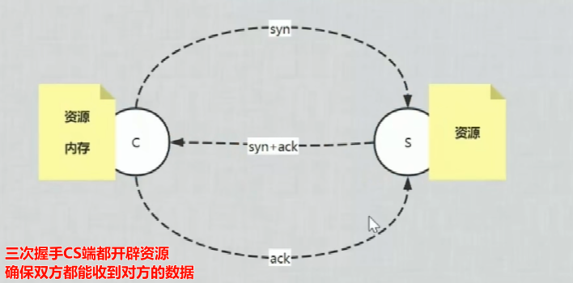

# vmware workstation  uninstall/install

vmware workstation pro彻底拆卸

1. 控制面板删除
2. 删除之前安装的内容
3. ccleaner或腾讯管家之类的软件删除注册表垃圾


百度安装vmware workstation pro17 

注册码

MC60H-DWHD5-H80U9-6V85M-8280D


vmware配置虚拟网络编辑器

VMnet8  NAT设置 

子网ip 192.168.101.0  

子网掩码 255.255.255.0

网关ip 192.168.101.2

# 新增虚拟机 CentOS-mini

CentOS-mini为最小化安装的centos7，后期对它克隆，重复使用

centos7最小化安装过程

https://blog.csdn.net/qq_46138492/article/details/128512782


centos7重启后初始化配置

```sh
cat /etc/system-release

#配置ip 
vi /etc/sysconfig/network-scripts/ifcfg-ens33
BOOTPROTO=static  
ONBOOT=yes #系统在启动时是否自动启用和配置相应的网络接口ens33
IPADDR=192.168.101.101
NETMASK=255.255.255.0 
GATEWAY=192.168.101.2
DNS1=8.8.8.8
#重启网卡
systemctl restart network 
```

vi init.sh

```sh
#yum源目录
cd /etc/yum.repos.d 

#备份官方源 
mv CentOS-Base.repo CentOS-Base.repo.bak 
echo '备份yum源ok'
#阿里源下载 重建源数据缓存 
curl -o /etc/yum.repos.d/CentOS-Base.repo http://mirrors.aliyun.com/repo/Centos-7.repo&&yum makecache 
echo '查看yum源配置文件'
ls -l

echo 'yum安装common tools'
yum install -y wget net-tools vim zip unzip bash-completion ntp nc telnet tree nmap sysstat lrzsz dos2unix bind-utils epel-release
echo '常用工具安装完毕'

#关闭selinux
echo '关闭selinux'
sudo sed -i 's/^SELINUX=enforcing/#SELINUX=enforcing/' /etc/selinux/config
sudo sed -i 's/^SELINUXTYPE=targeted/#SELINUXTYPE=targeted/' /etc/selinux/config 
sudo sed -i '$aSELINUX=disabled' /etc/selinux/config && cat /etc/selinux/config
#临时启用设置 永久需重启
setenforce 0 

#关闭防火墙并取消开机自启
echo '关闭防火墙'
systemctl stop firewalld && systemctl disable firewalld

sleep 1


# swap分区禁用 需重启
sudo sed -i '/\bswap\b/s/^/#/' /etc/fstab
```

touch monitor.sh

chmod +x monitor.sh 

vim monitor.sh

```sh
#!/bin/bash

# 获取系统信息
echo "=== 系统信息 ==="
uname -a
echo ""

# 获取磁盘空间使用情况
echo "=== 磁盘空间使用情况 ==="
df -h
echo ""

# 获取内存使用情况
echo "=== 内存使用情况 ==="
free -h
echo ""

# 获取 CPU 使用情况
echo "=== CPU 使用情况 ==="
top -bn1 | grep "Cpu"
echo ""

# 获取系统负载情况
echo "=== 系统负载情况 ==="
uptime
echo ""

# 获取网络连接信息
echo "=== 网络连接信息 ==="
netstat -tuln
echo ""
```


```sh
#需要时使用，目前未安装配置
#安装IPtables防火墙
#修改iptables配置文件 (默认开启了22端口，开启80端口和3306端口，以便后期lamp环境使用，注：80 为Apache默认端口，3306为MySQL的默认端口）
yum install -y iptables-services
vi /etc/sysconfig/iptables 

#添加到默认的22端口这条规则的下面 
-A INPUT -m state –state NEW -m tcp -p tcp –dport 80 -j ACCEPT 
-A INPUT -m state –state NEW -m tcp -p tcp –dport 3306 -j ACCEPT

#重启iptables并设置为开机自启项 
systemctl restart iptables.service 
systemctl enable iptables.service
```

关机后形成快照v1/CentOS-mini 后续再进行克隆


dhclient ens33 识别ens33网络接口


vpn Virtual Private Network 

通过一个公用网络(通常是因特网)建立一个临时的、安全的连接，是一条穿过混乱的公用网络的安全、稳定隧道。


VPN远程访问内部资源，用户多为单位工作人员


堡垒机 实质是 控制运维人员权限，记录运维人员操作

# Linux相关概念

EPEL (**Extra Packages for Enterprise Linux**) is a third-party repository of packages for the Fedora-based and CentOS/RHEL-based Linux distributions. It provides additional software packages that are not included in the default package repositories of these distributions.

# Linux命令

## 快捷键


Ctrl +r 查找历史命令

Ctrl + w \Ctrl + k:删除光标之前\之后的内容


VIM操作

```sh
ZZ or :wq 文件保存并退出 
/ 查找
dd 删除一行
yy 复制当前行
p 粘贴
:%s/aaa/bbb/gc 全局替换aaa为bbb 
# 跳到最后一行下一行
G
o

#替换192为198
%s/192/198/g
% 在整个文件范围内执行替换操作
s 替换（substitute）操作。
g 全局（global）替换，即在每一行中执行替换操作
```


进程操作
Ctrl + C 终止进程

Ctrl + Z 挂起一个进程


top命令中的快捷键
Shift +p:根据CPU使用率排序

Shift +m:根据内存占用排序

ctrl + c 强制停止

ctrl + d 退出或登出

ctrl + l clear 清空终端内容

history

!命令前缀 自动执行上一次匹配前缀的命令


光标移动

```
ctrl + a，跳到命令开头
ctrl + e，跳到命令结尾
ctrl + 左 alt b 向左跳一个单词
ctrl + 右 alt f 向右跳一个单词
```


## Linux的目录结构


/ 根目录

/home/test/a.txt 表示根目录下的home目录下的test目录内有a.txt

/bin 系统命令 比如 ls、cp、mkdir等。

/boot Linux的内核及引导系统程序所需文件

/dev 设备文件存储，比如声卡、磁盘... ...

/etc 系统配置文件，一些服务器的配置文件也在这里；比如用户帐号及密码配置文件；

/home 普通用户 

/lib 库文件

/lost+found 在ext2或ext3文件系统中，当系统意外崩溃或机器意外关机，而产生一些文件碎片放在这里。当系统启动的过程中fsck工具会检查这里，并修复已经损坏的文件系统。 有时系统发生问题，有很多的文件被移到这个目录中，可能会用手工的方式来修复，或移到文件到原来的位置上。

/mnt 挂载储存设备，比如有cdrom 等目录。可以参看/etc/fstab的定义。有时我们可以把让系统开机自动挂载文件系统，把挂载点放在这里也是可以的。主要看/etc/fstab中怎么定义了；比如光驱可以挂载到/mnt/cdrom 。

/opt目录是文件系统中的一个标准目录，用于存储可选的、第三方的、非系统级别的软件包和应用程序

/opt 不会与系统级别的软件包和应用程序发生冲突。这使得 `/opt` 成为安装和管理第三方软件的理想位置。

在 `/opt` 目录中，通常会按照软件的名称创建子目录，每个子目录包含该软件的所有文件和配置。这种结构使得软件的安装、升级和卸载变得非常简单，因为只需要将整个子目录删除即可。；通过源码包安装的软件，可以通过 ./configure --prefix=/opt/目录 。

/proc 目录中的文件和目录并不是真正的文件系统对象，而是在内存中的虚拟文件。这些虚拟文件可以被用户和应用程序读取和写入，以获取或修改系统信息。

/root 超级权限用户root的家目录；

/sbin 大多是涉及系统管理的命令的存放，是超级权限用户root的可执行命令存放地，普通用户无权限执行这个目录下的命令。

/tmp 临时文件，有时用户运行程序的时候，会产生临时文件。/tmp就用来存放临时文件的。/var/tmp目录和这个目录相似。

/usr 系统存放程序的目录，比如命令、帮助文件等。这个目录下有很多的文件和目录。当我们安装一个Linux发行版官方提供的软件包时，大多安装在这里。如果有涉及服务器配置文件的，会把配置文件安装在/etc目录中。/usr目录下包括涉及字体目录/usr/share/fonts ，帮助目录 /usr/share/man或/usr/share/doc，普通用户可执行文件目录/usr/bin 或/usr/local/bin 或/usr/X11R6/bin ，超级权限用户root的可执行命令存放目录，比如 /usr/sbin 或/usr/X11R6/sbin 或/usr/local/sbin 等；还有程序的头文件存放目录/usr/include。

/var 这个目录的内容是经常变动的，/var下有/var/log 这是用来存放系统日志的目录。/var/www目录是定义Apache服务器站点存放目录；/var/lib 用来存放一些库文件，比如MySQL的，以及MySQL数据库的的存放地；

**普通文件、目录文件、连接文件和特殊文件**

## file命令

file file_name

## 查看命令的帮助 ls --help

`命令 --help`查看命令的帮助手册

```
# man 命令 查看某命令的详细手册
man ls
man yum
info ls
info yum
```


## ssh免密登录

```sh
#本机生成公钥、私钥 在/root/.ssh下
ssh-keygen -t rsa

#copy /root/.ssh/id_ras.pub to 192.168.101.253的 /root/.ssh/authorized_keys
ssh-copy-id root@192.168.101.253
ssh-copy-id root@192.168.101.121
ssh-copy-id root@192.168.101.122
ssh-copy-id root@192.168.101.123
ssh-copy-id root@192.168.101.124

```


## yum 软件安装命令

```sh
#安装 删除 搜索 软件
yum install/remove/search -y software
-y 自动确认
yum install mlocate -y

#Ubuntu系统使用
apt [install remove search] [-y] 软件名

# yum 和 apt 均需 root权限
```


docker指定版本安装

https://docs.docker.com/engine/install/centos/#install-using-the-repository

```sh
sudo yum install docker-ce-3:19.03.15-3.el7 docker-ce-cli-3:19.03.15-3.el7 containerd.io docker-buildx-plugin docker-compose-plugin
```

或者使用2个sh脚本

## ls命令

ls list 列出文件夹信息

`ls [-l -h -a] [参数]`

```sh
ls -l  ll 以列表形式查看
ll -h 显示kb
ll -a 显示隐藏文件(.开头的文件/文件夹)
ll -t 时间
ll -r 逆序
ls -F 分类显示
```


## pwd

```sh
#print work directory
pwd 
```


## cd命令

cd change directory

cd  进入当前用户目录

cd ./ 当前 	cd ..上一级


## HOME目录

每一个用户在Linux系统中都有专属工作目录，称之为HOME目录。

- 普通用户的HOME目录，默认在：`/home/用户名`

- root用户的HOME目录，在：`/root`

SSH登陆终端后，默认是 用户的HOME目录


## 相对路径、绝对路径

- 相对路径

  以**当前目录**作为起点，去描述路径

  如 cd test/a.txt，表示进入当前目录内的test文件夹下的a.txt文件

- 绝对路径

  从`根`开始描述路径
  
  cd /etc/sysconfig/network-scripts/


## 特殊路径符

.  当前目录 	./a.txt 当前文件夹内的`a.txt`文件

.. 上级目录      ../../  上级的上级目录

~  用户的HOME目录 


## du disk usage

```sh
# 统计隐藏文件或目录
du -sh .[^.]*

# 统计所有文件和目录
du -sh .[^.]* *

# 结合 `sort -h`，可以快速得到比较大的目录
du -sh .[^.]* * |sort -h
```


## mkdir 创建文件夹

mkdir [-p] 参数

- 参数：被创建文件夹的路径
- 选项：-p，可选，表示**创建前置路径**   **mkdir /a/b/c -p**


## touch 创建文件

touch 被创建的文件路径

```sh
touch /etc/docker/daemon.json
vim /etc/docker/daemon.json
```

编辑新增的内容

{
  "registry-mirrors": ["https://0s0nyqqk.mirror.aliyuncs.com"]
}


## cat 查看文件内容

```sh
cat /etc/docker/daemon.json
```


## less more

```sh
#最佳实践 使用 less 替代 more
空格键：向下滚动一页。
Enter：向下滚动一行。
b 或 Shift + Page Up：向上滚动一页。

搜索功能：
/pattern 在文件中搜索特定的文本模式。
n 重复上一次搜索。
N 反方向重复上一次搜索。

利用跳转功能：
g 跳到文件开头。
G 跳到文件结尾。

#使用管道：
#less 可以与管道一起使用，以便查看命令输出：
command | less

#假设您有一个名为 example.txt 的文件，您想要查看其中的内容。
less example.txt
#在 less 中搜索特定的文本：
/search_pattern
#退出 less：
q
```


## cp 复制文件、文件夹

`cp [-r] source destination`

- 选项：-r 复制文件夹使用

示例：

- cp a.txt b.txt	复制当前目录下的 a.txt为b.txt
- cp a.txt test/    复制当前目录a.txt到test文件夹内
- cp -r test test2 复制文件夹test到当前文件夹内为test2内


## mv 移动文件、文件夹

`mv source destination`

- 参数1：被移动的
- 参数2：要移动去的地方，参数2如果不存在，则会进行改名

```sh
cd /etc/yum.repos.d
mv CentOS-Base.repo CentOS-Base.repo.bak
#阿里源文件下载
wget -O /etc/yum.repos.d/CentOS-Base.repo http://mirrors.aliyun.com/repo/Centos-7.repo 
```


## rm 删除文件、文件夹

语法：`rm [-r -f] 参数 参数`

- 参数：支持多个，每一个表示被删除的，空格进行分隔
- 选项：-r，删除文件夹使用
- 选项：-f，强制删除，不会给出确认提示，一般root用户会用到

> rm命令很危险，一定要注意，特别是切换到root用户的时候。


## which

查看命令的程序本体**文件路径**

```sh
[root@localhost yum.repos.d]# which cd
/usr/bin/cd
```


## find

find 起始路径 -name 搜索关键字

关键字支持通配符， 比如：*test表示搜索任意以test结尾的文件

```sh
find / -name docker
find /usr/local -name  *bin*
```


## locate

**CentOS7默认没有安装该命令** 

```sh
yum install mlocate -y
#初次使用必须先创建数据库
updatedb

locate -ie abc.txt 
#如果 abc.txt已经删除了，使用-e会检查文件是否真实存在，而不必updatedb；
#-i，忽略大小写
#在/etc中查找类似profile的文件
locate /etc/*profile 
```

locate通过数据库（/var/lib/mlocate/mlocate.db文件）来查找文件（当天新增的文件查询不到 使用sudo updatedb 可以立即更新数据库）


## wc命令

统计 word count

`wc [-c -m -l -w] 文件路径`

- 选项，-c，统计bytes数量
- 选项，-m，统计字符数量
- 选项，-l，统计行数
- 选项，-w，统计单词数量
- 参数，文件路径，被统计的文件，可作为内容输入端口

> 参数文件路径，可作为管道符的输入


## | 管道符

功能：将符号左边的结果，作为符号右边的输入

示例：

`cat a.txt | grep itheima` 

将cat a.txt的结果，作为grep命令的输入，用来过滤`itheima`关键字


支持嵌套：

`cat a.txt | grep itheima | grep itcast`


## echo 输出内容

语法：`echo 参数`

- 参数：被输出的内容

```sh
echo haha 	
echo $var
echo haha > a  # 覆盖
echo haha >> a # 追加
```


## 反引号	

被两个反引号包围的内容，会作为命令执行

示例：

- echo \`pwd\` 相当于输入pwd


## tail 

语法：`tail [-f] 参数`

- 参数：被查看的文件
- 选项：-f，持续跟踪文件修改

```
tail -f docker.log
tail -100 docker.log


组合使用 head 和 tail：
用于提取文件的中间部分。
tail -n +3 file.txt | head -n 5

与管道配合使用：
将 head 和 tail 的输出与其他命令结合使用，如 grep 或 awk。
tail -n 1000 log.txt | grep "error" | wc -l

文件内容的动态监控：
使用 -f 参数和 grep 来监控特定的事件或模式。
tail -f access.log | grep "404"
```


## head 

语法：`head [-n] 参数`

- 参数：被查看的文件
- 选项：-n，查看的行数

```
head -3 docker.log
```


## > 覆盖      >> 追加

功能：将符号左边的结果，输出到右边指定的文件中去

`>`   覆盖输出

ls > ls.txt

`>>` 追加到下一行输出

echo 'hh' >> a.txt

## vi

### 命令模式快捷键


### 底线命令快捷键


## grep 过滤关键字

语法：`grep [-n] 关键字 文件路径`

- -n 在结果中显示匹配的行号。
- 参数1，关键字，必填，表示过滤的关键字，带有空格或其它特殊符号，建议使用””将关键字包围起来
- 参数2，文件路径，必填，表示要过滤内容的文件路径，可作为内容输入端口

```sh
grep -n error /jydata/v5/web-log/app_error.log

ps -ef | grep   .jar
```


## sed 

```sh
# 流编辑器，用于对文本进行 模式匹配、替换、删除等操作
sed -i '2d' file.txt       # 删除第2行
sed -i '2,8d' file.txt     # 删除 2-8 行
sed -i '$d' file.txt       # 删除最后1行

sed -i '/^a/d' file.txt    # 删除以a开头的行
sed -i '/^[2021/d'app_out.log
sed -i '/7$/d' file.txt    # 删除以7结尾的行（7可以为任意字符串）

sed -i '/2022/d' file.txt    # 删除包含2022的行

#单文件替换
sed -i.bak 's/198\.18\.128\.220/198.18.128.100/g' serverConfig.json
#文件夹批量替换
find /jydata/config-100 -type f -exec sed -i 's/198.18.128.220/198.18.128.100/g' {} \;
#!/bin/bash

# 假设需要替换的IP地址作为环境变量传入
OLD_IP=198.18.128.220
NEW_IP=198.18.128.100

# 替换单个文件中IP地址 sed -i.bak可以在修改的同时创建一个原始文件的备份 serverConfig.json.bak
if sed -i.bak "s/${OLD_IP}/${NEW_IP}/g" serverConfig.json; then
    echo "serverConfig.json中IP地址已成功替换。"
else
    echo "替换serverConfig.json中IP地址时出错！"
fi

# 在config-100目录下查找所有文件，并替换IP地址
find config-100 -type f -exec sed -i.bak "s/${OLD_IP}/${NEW_IP}/g" {} \; -print
if [ $? -eq 0 ]; then
    echo "config-100目录下所有文件的IP地址已成功替换。"
else
    echo "替换config-100目录下文件中的IP地址时出错！"
fi

# 替换adapter.js中IP地址
if sed -i.bak "s/${OLD_IP}/${NEW_IP}/g" adapter.js; then
    echo "adapter.js中IP地址已成功替换。"
else
    echo "替换adapter.js中IP地址时出错！"
fi
```


## awk

```sh
#文本处理工具，它可以处理每一行中的字段，并执行复杂的文本操作。
#示例：打印文件中的第 2 列。
awk '{print $2}' filename.txt
```


## systemctl

控制 系统服务的 启停等

语法：`systemctl start | stop | restart | disable | enable | status 服务名`

- start
- stop
- status
- disable 取消开机自启
- enable 开机自启
- restart

系统内置的服务比较多，比如：

```
NetworkManager 主网络服务
network 	   副网络服务
firewalld      防火墙服务
sshd		   ssh服务 secure shell
```


## 软链接 ln -s 

创建文件、文件夹的软链接（快捷方式）

`ln -s 参数1 参数2`

- 参数1：被链接的
- 参数2：要链接去的地方（快捷方式的名称和存放位置）

```
ln -s /etc/yum.conf ~/yum.conf
```

### 硬链接 (Hard Links) 

相当于指针

**定义**：

- 硬链接指向文件系统的同一索引节点（inode）。
- 每个文件至少有一个硬链接，即文件本身。
- 删除硬链接中的任何一个不会影响文件本身或其他硬链接。

## 日期

语法：`date [-d] [+格式化字符串]`

- -d 按照给定的字符串显示日期，一般用于日期计算

- 格式化字符串：通过特定的字符串标记，来控制显示的日期格式
  - %Y   年%y   年份后两位数字 (00..99)
  - %m   月份 (01..12)
  - %d   日 (01..31)
  - %H   小时 (00..23)
  - %M   分钟 (00..59)
  - %S   秒 (00..60)
  - %s   自 1970-01-01 00:00:00 UTC 到现在的秒数


示例：

- 按照2022-01-01的格式显示日期

  

- 按照2022-01-01 10:00:00的格式显示日期

  

- -d选项日期计算

  

  - 支持的时间标记为：

    


## 时区

修改时区为中国时区

```sh
mv /etc/localtime /etc/localtime-bak
sudo ln -s /usr/share/zoneinfo/Asia/Shanghai /etc/localtime

```


## ntp

Network Time Protocol

```sh
#查看设置系统时区
rm -rf /etc/localtime
ln -sf /usr/share/zoneinfo/Asia/Shanghai /etc/localtime

#安装ntp并同步时间
yum install -y ntp
ntpdate -u ntp.aliyun.com

sudo systemctl enable ntpd && sudo systemctl start ntpd

#查看系统硬件时间
hwclock --show
#从当前系统时间设置硬件时间
hwclock -w

#!/bin/bash

# 安装 NTP 软件包
yum install -y ntp

# 配置 NTP 服务器
echo "server ntp.aliyun.com " >> /etc/ntp.conf
echo "server ntp1.aliyun.com " >> /etc/ntp.conf
echo "server ntp2.aliyun.com " >> /etc/ntp.conf
echo "server ntp3.aliyun.com " >> /etc/ntp.conf
echo "server ntp4.aliyun.com " >> /etc/ntp.conf
echo "server ntp5.aliyun.com " >> /etc/ntp.conf

#注释默认NTP服务器
sudo sed -i 's/^server 0\.centos\.pool\.ntp\.org iburst/#&/' /etc/ntp.conf
sudo sed -i 's/^server 1\.centos\.pool\.ntp\.org iburst/#&/' /etc/ntp.conf
sudo sed -i 's/^server 2\.centos\.pool\.ntp\.org iburst/#&/' /etc/ntp.conf
sudo sed -i 's/^server 3\.centos\.pool\.ntp\.org iburst/#&/' /etc/ntp.conf

# 重启 NTP 服务
systemctl restart ntpd

# 设置开机自启动
systemctl enable ntpd

# 检查时间同步状态
ntpq -p
```


## ip地址 

ifconfig

ip a

特殊IP：

- 127.0.0.1 本机
- 0.0.0.0
  - 可以表示本机
  - 也可以表示任意IP（看使用场景）


## 主机名 hostname

查看当前主机名

```
hostname
```


设置主机名

```sh
hostnamectl set-hostname newHostName
cat /etc/hosts
```


## 配置VMware固定IP

```sh
vim /etc/sysconfig/network-scripts/ifcfg-ens33
```

```shell
TYPE="Ethernet"
PROXY_METHOD="none"
BROWSER_ONLY="no"
BOOTPROTO="static"			# 改为static，固定IP
DEFROUTE="yes"
IPV4_FAILURE_FATAL="no"
IPV6INIT="yes"
IPV6_AUTOCONF="yes"
IPV6_DEFROUTE="yes"
IPV6_FAILURE_FATAL="no"
IPV6_ADDR_GEN_MODE="stable-privacy"
NAME="ens33"
UUID="1b0011cb-0d2e-4eaa-8a11-af7d50ebc876"
DEVICE="ens33"
ONBOOT="yes"           			# yes 开启启用
IPADDR="192.168.101.111"		# IP地址，自己设置，要匹配网络范围
NETMASK="255.255.255.0"		# 子网掩码，固定写法255.255.255.0
GATEWAY="192.168.101.2"		# 网关，要和VMware中配置的一致
DNS1="192.168.101.2"	    # DNS1服务器，和网关一致即可

systemctl restart network
```


## 防火墙

硬件防火墙


软件防火墙

	iptables
	firewalld


显示当前活动的防火墙配置：

```sh
sudo firewall-cmd --list-all
```


获取特定区域（zone）的配置：

```sh
sudo firewall-cmd --zone=<zone> --list-all
```

将 `<zone>` 替换为您要获取配置的区域名称，例如 `public`、`internal` 等。


临时添加防火墙规则（仅在运行时生效，重启后失效）：

```sh
sudo firewall-cmd --zone=public --add-port=80/tcp
sudo firewall-cmd --zone=public --add-service=http
```


永久添加防火墙规则（持久生效）：

```sh
sudo firewall-cmd --zone=<zone> --add-<service/port> --permanent
```


移除防火墙规则：

```sh
sudo firewall-cmd --zone=<zone> --remove-<service/port>
```

将 `<zone>` 替换为适用的区域名称，`<service/port>` 替换为要移除的服务或端口。


## 网络相关命令




socket 四元组 唯一


```sh
tcpdump -nn -i ens33 port 80

curl www.baidu.com

tcpdump: verbose output suppressed, use -v or -vv for full protocol decode
listening on ens33, link-type EN10MB (Ethernet), capture size 262144 bytes
ins16:11:32.579358 IP 192.168.101.120.45994 > 180.101.50.242.80: Flags [S], seq 2339230862, win 29200, options [mss 1460,sackOK,TS val 2478908840 ecr 0,nop,wscale 7], length 0 S是同步    序列大小  		 窗口大小
16:11:32.591298 IP 180.101.50.242.80 > 192.168.101.120.45994: Flags [S.], seq 2130207605, ack 2339230863, win 64240, options [mss 1460], length 0                 .代表ack
16:11:32.591369 IP 192.168.101.120.45994 > 180.101.50.242.80: Flags [.], ack 1, win 29200, length 0
16:11:32.591497 IP 192.168.101.120.45994 > 180.101.50.242.80: Flags [P.], seq 1:78, ack 1, win 29200, length 77: HTTP: GET / HTTP/1.1					P代表push 数据length太小时不需要缓存，直接发送数据
16:11:32.591769 IP 180.101.50.242.80 > 192.168.101.120.45994: Flags [.], ack 78, win 64240, length 0
16:11:32.599648 IP 180.101.50.242.80 > 192.168.101.120.45994: Flags [P.], seq 1:2782, ack 78, win 64240, length 2781: HTTP: HTTP/1.1 200 OK 服务器发送响应数据
16:11:32.599701 IP 192.168.101.120.45994 > 180.101.50.242.80: Flags [.], ack 2782, win 33580, length 0
#四次分手 完成后释放内存资源socket
16:11:32.600008 IP 192.168.101.120.45994 > 180.101.50.242.80: Flags [F.], seq 78, ack 2782, win 33580, length 0
16:11:32.600233 IP 180.101.50.242.80 > 192.168.101.120.45994: Flags [.], ack 79, win 64239, length 0
16:11:32.609189 IP 180.101.50.242.80 > 192.168.101.120.45994: Flags [FP.], seq 2782, ack 79, win 64239, length 0
16:11:32.609261 IP 192.168.101.120.45994 > 180.101.50.242.80: Flags [.], ack 2783, win 33580, length 0
^C
11 packets captured
11 packets received by filter
0 packets dropped by kernel
```


### 网卡配置

```sh
#网卡命名规则受biosdevname和net.ifnames两个参数影响
#编辑/etc/default/grub文件，增加 biosdevname=0 net.ifnames=O
#更新grub
grub2-mkconfig -o / boot/grub2/grub.cfg

#重启生效
reboot
```


```sh
#查看网卡物理连接情况
[root@localhost grub2]# mii-tool ens33
ens33: negotiated 1000baseT-FD flow-control, link ok

#查看网关
route -n
```


参数解析:
Destination表示网络号
Gateway 网关地址，网络是通过该IP出口，如果显示0.0.0.0，表示该路由信息，是从本机转发出去的

Genmask 子网掩码地址，IP地址配合子网掩码，才是一个完整的网络信息
Flags:路由标记，标记当前的网络状态
U Up运行的状态
G 表示是一个网关路由器

H 表示这个网关是一个主机
！表示当前这个路由已禁止

```
ip addr ls
ifconfig
ip addr add 10.0.0.1/24 dev eth1
ifconfig eth1 10.0.0.1 netmask 255.255.255.0. ip route add 10.0.0/24 via 192.168.0.1
route add -net 10.0.0.0 netmask 255.255.255.0 gw 192.168.0.1
```


#### 端口

1. 端口
   计算机和外部交互的出入口，可以分为 物理端口 和 虚拟端口
   物理端口：USB、HDMI、DP、VGA、RJ45等
   虚拟端口：操作系统 和 外部 交互的出入口
   IP+port 锁定 要交互的程序
2. 端口的划分
   公认端口：1~1023，用于系统内置或常用知名软件绑定使用
   注册端口：1024~49151，用于松散绑定使用（用户自定义）
   动态端口：49152~65535，用于临时使用（多用于出口）
3. 查看端口占用

```sh
#查看指定IP的对外暴露端口
nmap IP地址

netstat -anp | grep 3306
#端口号，查看本机指定端口号的占用情况
```


```sh
#查询某端口号的进程信息
sudo netstat -tulnp | grep :10000
tcp6       0      0 :::10000                :::*                    LISTEN      595960/java
[root@app ~]# lsof -p 595960
COMMAND    PID USER   FD      TYPE             DEVICE SIZE/OFF      NODE NAME
java    595960 root  cwd       DIR             253,17     4096  36837898 /jydata/v5/main-server/registrer
```


### 网络故障排除

#### ping

测试网络是否联通

语法：`ping [-c num] url`

```
#ping3次百度
ping -c 3 www.baidu.com
```


#### netstat

查看**网络状态和统计信息** ，显示当前TCP/IP连接、路由表、网络接口信息等。常用于故障排除，诊断网络问题以及监视网络活动。

常见的netstat选项：

- -a：显示所有的网络连接（包括监听和非监听状态）。
- -t：只显示TCP协议的连接。
- -u：只显示UDP协议的连接。
- -n：使用数字形式显示网络地址和端口号，不要解析成名称。
- -p：显示与连接相关的程序名和进程ID。
- -r：显示路由表信息。
- -i：显示网络接口状态。
- -l   display listening server sockets

例如，使用netstat -tunap命令可列出所有正在进行的TCP和UDP连接。该命令列出每个连接的本地和远程IP地址、端口号、协议和当前状态，以及与每个连接相关联的程序名称和进程ID。

netstat 使管理员能够 定位和解决 各种网络问题。


`nc`（Netcat）是一个强大的网络工具，用于创建 TCP 或 UDP 连接，以及读写数据。它可以用于各种网络任务，如端口扫描、文件传输、网络调试等。


```sh
nc www.baidu.com 80

netstat -anutpl|grep nc
Proto Recv-Q Send-Q Local Address           Foreign Address         State       PID/Program name
tcp        0      0 192.168.101.120:33124   180.101.50.242:80       ESTABLISHED  65052/nc
#这一行理解成四元组 socket
```

State状态值

1. **LISTEN**：表示服务器正在监听来自客户端的连接请求。服务器处于等待状态，等待客户端发起连接。
2. **SYN_SENT**：表示客户端已经发送了 SYN 包（同步包），正在等待服务器的确认。这是 TCP 三次握手过程中的第一个状态。
3. **SYN_RECEIVED**：表示服务器已经收到了客户端发送的 SYN 包，并发送了 SYN+ACK 包（同步确认包）给客户端。这是 TCP 三次握手过程中的第二个状态。
4. **ESTABLISHED**：表示 TCP 连接已经建立，数据可以在客户端和服务器之间传输。这是一个稳定的连接状态。
5. **FIN_WAIT_1**：表示主动关闭连接的一方（通常是客户端）已经发送了 FIN 包（结束包），正在等待对方的确认。这是 TCP 四次挥手过程中的第一个状态。
6. **FIN_WAIT_2**：表示主动关闭连接的一方已经收到了对方的确认，正在等待对方发送 FIN 包。这是 TCP 四次挥手过程中的第二个状态。
7. **CLOSE_WAIT**：表示被动关闭连接的一方（通常是服务器）已经收到了对方发送的 FIN 包，但还没有准备好关闭连接。此时，服务器可能仍在处理数据或等待应用程序释放资源。
8. **CLOSING**：表示主动关闭连接的一方已经收到了对方的 FIN 包，并发送了自己的 FIN 包。这是 TCP 四次挥手过程中的第三个状态。
9. **LAST_ACK**：表示被动关闭连接的一方已经发送了 FIN 包，正在等待对方的确认。这是 TCP 四次挥手过程中的第四个状态。
10. **TIME_WAIT**：表示主动关闭连接的一方已经收到了对方的确认，但还没有释放连接资源。此状态会持续一段时间，以确保对方收到自己发送的 FIN 包。
11. **CLOSED**：表示连接已经关闭，没有任何活动。这是一个空闲状态。

## ps

ps -ef 查看全部进程信息，搭配grep做过滤：`ps -ef | grep xxx`

```
UID：进程所属的用户ID
PID：进程的进程号ID
PPID：进程的父ID（启动此进程的其它进程）
C：此进程的CPU占用率（百分比）
STIME：进程的启动时间
TTY：启动此进程的终端序号，如显示?，表示非终端启动
TIME：进程占用CPU的时间
CMD：进程对应的名称或启动路径或启动命令
```

```sh
#查看进程执行命令
ps -p 进程ID -o cmd
或者
ll /proc/1270361/exe
lrwxrwxrwx 1 root root 0 Apr 12 17:20 /proc/1270361/exe -> /usr/local/jdk8/bin/java
```


杀死进程 kill -9 pid


## wget

非交互式的文件下载器，下载网络文件
语法：wget -b url
-b 后台下载，会将日志写入到当前工作目录的wget-log文件
url 下载链接

下载apache-hadoop 3.3.0版本

wget http://archive.apache.org/dist/hadoop/common/hadoop-3.3.0/hadoop-3.3.0.tar.gz

在后台下载

wget -b http://archive.apache.org/dist/hadoop/common/hadoop-3.3.0/hadoop-3.3.0.tar.gz

通过tail命令可以监控后台下载进度

tail -f wget-log


## curl

发送http网络请求,用于下载文件、获取信息等

curl [-o] url 
-O 用于下载文件，当url是下载链接时，可以使用此选项保存文件


```sh
#获取主机的公网ip
curl cip.cc
 
#先切换到对应的目录再下载文件
curl -O https://mirrors.tuna.tsinghua.edu.cn/virtualbox/LATEST.TXT
```


## top 查看主机运行状态

top

shift + p

shift + c

可用选项：


交互式模式中，可用快捷键：


## 磁盘挂载

```
fdisk -l

#MBR分区方式转换成GPT
parted /dev/vdb
mklabel gpt
quit

#创建新分区
fdisk /dev/vdb
n #新增一个分区
选择默认值
p #
wq

fdisk -l
#格式化分区
mkfs -t ext4 /dev/vdb1

#挂载新分区
mkdir /jydata
mount /dev/vdb1 /jydata
lsblk

#永久挂载 修改系统挂载硬盘的文件，其中0 0 表示在在开机时不对分区进行检查
echo "/dev/vdb1 /jydata ext4 defaults 0 0" | sudo tee -a /etc/fstab
```


## df   	disk free


## iostat  查看CPU、磁盘的相关信息


## sar 网络统计

sar -n DEV 3 2


## 环境变量 export 变量名=变量值

- 临时设置：export 变量名=变量值
- 永久设置：
  - 针对用户，设置用户HOME目录内：.bashrc 文件
  - 针对全局配置，vim /etc/profile
  - 配置完成后，source /etc/profile 立刻生效


### PATH变量

记录了 执行程序的搜索路径

`PATH`变量的值 是 一系列目录路径，路径由 : 分隔。当在shell中输入一个命令时，shell按照`PATH`变量中指定的顺序在这些目录中查找可执行文件。如果在某个目录中找到了与输入的命令名称相匹配的可执行文件，shell就会执行该文件。如果在所有目录中都没有找到匹配的可执行文件，shell会报告“command not found”错误。


## $  取出变量的值

`$变量名`

示例：

`echo $PATH`，输出PATH环境变量的值

`echo ${PATH}ABC`，输出PATH环境变量的值以及ABC

如果变量名和其它内容混淆在一起，可以使用${}


## 压缩 解压

### 压缩

`tar -zcvf 压缩包名称 被压缩1...被压缩2...被压缩N`

-c compress


`zip [-r] 参数1 参数2 参数N`

```shell
zip test.zip a.txt b.txt c.txt 	#将3个txt压缩到test.zip

zip -r test.zip test test2 a.txt #将test、test2两个文件夹和a.txt文件，压缩到test.zip文件内
```


### 解压

`tar -zxvf 被解压的文件 -C 目的地`

- -z 使用gzip，可以省略
- -x 解压缩操作
- -v 详细模式，即在屏幕上显示正在处理的文件信息。
- -f 指定文件
- -C 可省略，指定 要解压去的地方，不写解压到当前目录

```
tar -zxvf node.tar.gz -C ./test
```


`unzip [-d] 参数`

语法：unzip [-d] 参数 

-d，指定要解压去的位置，同tar的-C

参数，被解压的zip压缩包文件

```sh
#将test.zip解压到当前目录
unzip test.zip 

#将test.zip解压到指定文件夹内（/home/itheima）
unzip test.zip -d /home/itheima 
```


## su switch user

切换用户

语法：`su [-] [用户]`


## sudo


比如：

```shell
itheima ALL=(ALL)       NOPASSWD: ALL
```

visudo命令

配置如上内容，可以让itheima用户，无需密码直接使用`sudo`


## genent命令

`getent`  "get entries from administrative database"，从系统的各种数据库（如 passwd、group 和 hosts）中获取条目的命令。使用 `getent` 命令可以在 Linux 系统上检索与用户、组和网络信息相关的条目。

```sh
#查看系统全部的用户组
getent group
```


组名称:组认证(显示为x):组ID

```sh
#查看系统全部的用户
getent passwd
```


用户名:密码(x):用户ID:组ID:描述信息(无用):HOME目录:执行终端(默认bash)


文件、文件夹的

权限控制信息
所属用户
所属用户组


## 用户组管理

```sh
groupadd 用户组名
groupdel 用户组名	
```


## 用户管理

```sh
以下命令需root用户执行

创建用户
useradd [-g -d] 用户名
-g 指定 用户的组，不指定-g，会创建同名组并自动加入，指定-g需要组已经存在，如已存在同名组，必须使用-g
-d 指定 用户HOME路径，
   不指定，HOME目录默认在：/home/用户名

useradd -g root vijay

删除用户
userdel [-r] 用户名
-r 删除用户的HOME目录，
不使用-r，删除用户时，HOME目录保留

查看用户所属组
id [用户名]
参数：用户名，被查看的用户，如果不提供则查看自身

修改用户所属组
usermod -aG 用户组 用户名，将指定用户加入指定用户组
modify

```


## chmod change mode 

修改 文件、文件夹的 访问权限

```
chmod 777 filename
chmod -R 777 文件夹及内部所有
```

chmod -R 权限 参数

权限，要设置的权限，比如755，表示：`rwx r-x r-x`

参数，被修改的文件、文件夹

-R 设置文件夹和其内部全部内容一样生效

rwx 421


## chown change owner

修改文件、文件夹的**用户、组**

语法：`chown [-R] [用户][:][用户组] 文件或文件夹`

```sh
#此命令只适用于root用户执行
chown root hello.txt，将hello.txt所属用户修改为root
chown :root hello.txt，将hello.txt所属用户组修改为root
chown root:itheima hello.txt，将hello.txt所属用户修改为root，用户组修改为itheima
chown -R root test，将文件夹test的 所属用户 修改为 root并对文件夹内全部内容应用同样规则
```


## env

查看系统全部的环境变量

env

```sh
查看环境变量：
echo $VARIABLE_NAME 显示指定环境变量的值。
echo $PATH 显示 PATH 环境变量的值。

printenv：列出所有环境变量及其值。

设置临时环境变量：
VARIABLE_NAME=value：设置临时环境变量的值。例如，LANG=en_US.UTF-8 设置 LANG 环境变量为 en_US.UTF-8。

设置永久环境变量（对当前用户）：
编辑 ~/.bashrc 或 ~/.bash_profile 文件，在文件末尾添加 export VARIABLE_NAME=value，然后保存并退出。例如，export JAVA_HOME=/usr/lib/jvm/java-11 设置 JAVA_HOME 环境变量为 /usr/lib/jvm/java-11。
运行 source ~/.bashrc 或 source ~/.bash_profile 使修改生效。

设置永久环境变量（对所有用户）：
编辑 /etc/environment 文件，在文件中添加 VARIABLE_NAME=value 行。例如，JAVA_HOME="/usr/lib/jvm/java-11" 设置 JAVA_HOME 环境变量为 /usr/lib/jvm/java-11。

删除环境变量：
unset VARIABLE_NAME：删除临时环境变量或当前用户的永久环境变量。
编辑相应的配置文件，将环境变量的定义删除。
```