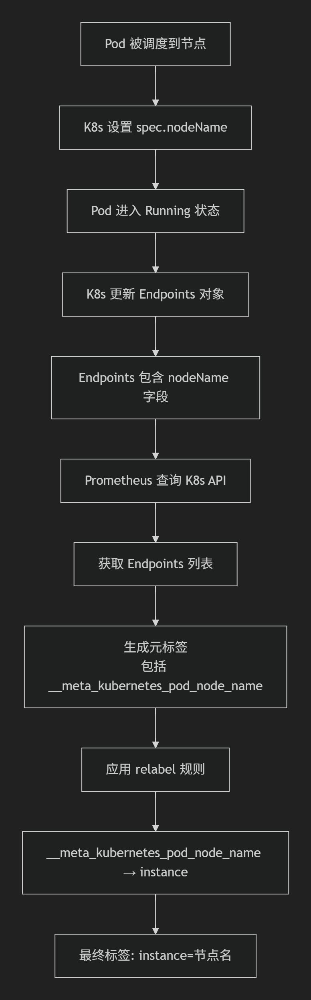

https://blog.csdn.net/YCyjs/article/details/144134678

## 一、node-exporter 安装

control-panel-1执行

1.创建监控 namespace
kubectl create ns monitoring

2.部署 node-exporter 9100
vim node-exporter.yaml

```yml
apiVersion: apps/v1        # 资源类型API版本
kind: DaemonSet            # 资源类型：确保每个节点运行一个Pod
metadata:
  name: node-exporter      # DaemonSet名称
  namespace: monitoring    # 部署的命名空间
spec:
  selector:                # 选择器：管理哪些Pod
    matchLabels:
      app: node-exporter
  template:                # Pod模板
    metadata:
      labels:
        app: node-exporter
    spec:
      containers:
      - name: node-exporter
        image: prom/node-exporter:v1.8.2
        ports:
        - containerPort: 9100
        args:              # 容器启动参数
        - --path.procfs=/host/proc   # 挂载/proc目录
        - --path.sysfs=/host/sys     # 挂载/sys目录
        - --path.rootfs=/rootfs      # 挂载根目录
        volumeMounts:      # 挂载宿主机目录到容器目录
        - name: proc
          mountPath: /host/proc
        - name: sys
          mountPath: /host/sys
        - name: rootfs
          mountPath: /rootfs
      volumes:             # 定义卷
      - name: proc
        hostPath:          # 宿主机目录
          path: /proc
      - name: sys
        hostPath:
          path: /sys
      - name: rootfs
        hostPath:
          path: /
---
apiVersion: v1
kind: Service
metadata:
  name: node-exporter
  namespace: monitoring
  labels:
    app.kubernetes.io/name: node-exporter
    app.kubernetes.io/instance: node-exporter
    app.kubernetes.io/version: "v1.8.2"
  annotations:
    # 监控相关注解
    prometheus.io/scrape: "true"
    prometheus.io/port: "9100"
    prometheus.io/path: "/metrics"
    prometheus.io/scheme: "http"
    # 服务发现注解
    discovery.3scale.net/scheme: "http"
    discovery.3scale.net/port: "9100"
    discovery.3scale.net/path: "/metrics"
spec:
  type: ClusterIP
  #clusterIP: 10.233.1.173  # 可选：固定IP，便于网络策略
  ports:
  - name: metrics
    port: 9100
    targetPort: 9100
    protocol: TCP
  - name: metrics-tls
    port: 9101
    targetPort: 9101
    protocol: TCP
  selector:
    app.kubernetes.io/name: node-exporter
    app.kubernetes.io/instance: node-exporter
  sessionAffinity: None
            
```


```yaml
k apply -f node-exporter.yaml

#hostNetwork、hostIPC、hostPID都为True时，表示这个Pod里的所有容器，会直接使用宿主机的网络，直接与宿主机进行IPC（进程间通信）通信，可以看到宿主机里正在运行的所有进程。加入了hostNetwork:true会直接将我们的宿主机的9100端口映射出来，从而不需要创建service在我们的宿主机上就会有一个9100的端口。

kubectl apply -f node-exporter.yaml
kubectl get pod -n monitoring -owide

```


3、通过 node-exporter 采集数据
node-exporter 默认的监听端口 9100，可以执行 curl http://主机ip:9100/metrics 获取到主机的所有监控数据

curl -Ls http://192.168.101.41:9100/metrics | grep node_cpu_seconds

curl -Ls http://192.168.88.10:9100/metrics | grep node_load


## 二、Prometheus 安装和配置

（1）创建 sa 账号，对 sa 做 rbac 授权
创建一个 sa 账号 monitor

```
kubectl create serviceaccount monitor -n monitoring
```

把 sa 账号 monitor 通过 clusterRolebing 绑定到 clusterrole 上

```bash
kubectl create clusterrolebinding monitor-clusterrolebinding -n monitoring --clusterrole=cluster-admin  --serviceaccount=monitoring:monitor
```

创建一个clusterrolebinding  叫  monitor-clusterrolebinding   clusterrole角色是cluster-admin  账号是monitoring命名空间下的monitor

- `create clusterrolebinding`: 创建一个 `ClusterRoleBinding`，使得 **ServiceAccount** 能够访问集群范围的资源。
- `monitor-clusterrolebinding`: 这是您创建的 ClusterRoleBinding 的名字。
- `--clusterrole=cluster-admin`: 指定绑定的权限集，`cluster-admin` 是最高权限，通常用于集群管理员。
- `--serviceaccount=monitoring:monitor`: `monitoring 是命名空间为 `monitor` 下的 ServiceAccount，您将该 ServiceAccount 与 `cluster-admin` 权限绑定。
- `-n monitoring: 这是 `namespace`，指定了 `ServiceAccount` 的命名空间


（2）创建一个 configmap 存储卷，用来存放 prometheus 配置信息
vim prometheus-cfg.yaml

```yml
apiVersion: v1
kind: ConfigMap
metadata:
  name: prometheus-config
  namespace: monitoring
  labels:
    app: prometheus
    component: config
data:
  # 告警规则文件
  prometheus.rules: |-
    groups:
    - name: demo-alerts
      rules:
      - alert: HighPodMemoryUsage
        expr: sum(container_memory_usage_bytes) > 1
        for: 1m
        labels:
          severity: warning
          team: devops
        annotations:
          summary: "High Memory Usage detected"
          description: "Container memory usage exceeds threshold"

  # 主配置文件
  prometheus.yml: |-
    # 全局配置
    global:
      scrape_interval: 15s
      evaluation_interval: 15s
      external_labels:
        cluster: "production"
        environment: "k8s"

    # 告警规则文件
    rule_files:
      - /etc/prometheus/prometheus.rules

    # Alertmanager 配置
    alerting:
      alertmanagers:
        - scheme: http
          static_configs:
            - targets:
              - "alertmanager.monitoring.svc.cluster.local:9093"

    # 抓取配置
    scrape_configs:
      # 1. Node Exporter - 节点级监控 cpu 内存 io 网络 负载
      - job_name: 'node-exporter'
        kubernetes_sd_configs:
          - role: pod
            namespaces:
              names: [monitoring]
        relabel_configs:
          # 只抓取带有 node-exporter 标签的 Pod
          - source_labels: [__meta_kubernetes_pod_label_app_kubernetes_io_name]
            action: keep
            regex: node-exporter
          # 修正端口为 9100
          - source_labels: [__address__]
            action: replace
            regex: ([^:]+)(?::\d+)?
            replacement: $1:9100
            target_label: __address__
          # 使用节点名称作为 instance 标签
          - source_labels: [__meta_kubernetes_pod_node_name]
            target_label: instance
          # 添加 Pod 名称标签
          - source_labels: [__meta_kubernetes_pod_name]
            target_label: pod

      # 2. Kubernetes API Server
      - job_name: 'k8s-apiserver'
        kubernetes_sd_configs:
          - role: endpoints
            namespaces:
              names: [default]
        scheme: https
        tls_config:
          ca_file: /var/run/secrets/kubernetes.io/serviceaccount/ca.crt
          insecure_skip_verify: true
        bearer_token_file: /var/run/secrets/kubernetes.io/serviceaccount/token
        relabel_configs:
          # 只抓取 kubernetes 服务
          - source_labels: [__meta_kubernetes_service_name, __meta_kubernetes_endpoint_port_name]
            action: keep
            regex: kubernetes;https
          # 添加命名空间标签
          - source_labels: [__meta_kubernetes_namespace]
            target_label: namespace

      # 3. Pod 自动发现 (基于注解)
      - job_name: 'kubernetes-pods'
        kubernetes_sd_configs:
          - role: pod
        relabel_configs:
          # 只抓取有 prometheus.io/scrape: "true" 注解的 Pod
          - source_labels: [__meta_kubernetes_pod_annotation_prometheus_io_scrape]
            action: keep
            regex: "true"
          # 自定义指标路径
          - source_labels: [__meta_kubernetes_pod_annotation_prometheus_io_path]
            action: replace
            target_label: __metrics_path__
            regex: (.+)
          # 自定义端口
          - source_labels: [__address__, __meta_kubernetes_pod_annotation_prometheus_io_port]
            action: replace
            regex: ([^:]+)(?::\d+)?;(\d+)
            replacement: $1:$2
            target_label: __address__
          # 添加 Pod 标签
          - action: labelmap
            regex: __meta_kubernetes_pod_label_(.+)
          # 标准化命名空间标签
          - source_labels: [__meta_kubernetes_namespace]
            target_label: namespace
          # 标准化 Pod 名称标签
          - source_labels: [__meta_kubernetes_pod_name]
            target_label: pod
          # 标准化容器名称标签
          - source_labels: [__meta_kubernetes_pod_container_name]
            target_label: container

      # 4. Service 自动发现 (基于注解)
      - job_name: 'kubernetes-services'
        kubernetes_sd_configs:
          - role: endpoints
        relabel_configs:
          # 只抓取有 prometheus.io/scrape: "true" 注解的 Service
          - source_labels: [__meta_kubernetes_service_annotation_prometheus_io_scrape]
            action: keep
            regex: "true"
          # 自定义协议
          - source_labels: [__meta_kubernetes_service_annotation_prometheus_io_scheme]
            action: replace
            target_label: __scheme__
            regex: (https?)
          # 自定义指标路径
          - source_labels: [__meta_kubernetes_service_annotation_prometheus_io_path]
            action: replace
            target_label: __metrics_path__
            regex: (.+)
          # 自定义端口
          - source_labels: [__address__, __meta_kubernetes_service_annotation_prometheus_io_port]
            action: replace
            regex: ([^:]+)(?::\d+)?;(\d+)
            replacement: $1:$2
            target_label: __address__
          # 添加 Service 标签
          - action: labelmap
            regex: __meta_kubernetes_service_label_(.+)
          # 标准化命名空间标签
          - source_labels: [__meta_kubernetes_namespace]
            target_label: namespace
          # 标准化 Service 名称标签
          - source_labels: [__meta_kubernetes_service_name]
            target_label: service

      # 5. Kube-state-metrics
      - job_name: 'kube-state-metrics'
        static_configs:
          - targets: 
            - 'kube-state-metrics.kube-system.svc.cluster.local:8080'
        relabel_configs:
          - target_label: job
            replacement: kube-state-metrics

      # 6. cAdvisor (容器指标)
      - job_name: 'k8s-cadvisor'
        scheme: https
        tls_config:
          ca_file: /var/run/secrets/kubernetes.io/serviceaccount/ca.crt
          insecure_skip_verify: true
        bearer_token_file: /var/run/secrets/kubernetes.io/serviceaccount/token
        kubernetes_sd_configs:
          - role: node
        relabel_configs:
          # 映射节点标签
          - action: labelmap
            regex: __meta_kubernetes_node_label_(.+)
          # 设置目标地址为 API Server
          - target_label: __address__
            replacement: kubernetes.default.svc:443
          # 设置 cAdvisor 指标路径
          - source_labels: [__meta_kubernetes_node_name]
            regex: (.+)
            target_label: __metrics_path__
            replacement: /api/v1/nodes/${1}/proxy/metrics/cadvisor
          # 使用节点名称作为 instance 标签
          - source_labels: [__meta_kubernetes_node_name]
            target_label: instance
```




## **完整的时间线**

| 时间 | 事件                            | 数据位置                                                 |
| ---- | ------------------------------- | -------------------------------------------------------- |
| T0   | 创建 DaemonSet（node-exporter） | 无                                                       |
| T1   | K8s 调度器决定 Pod 到 worker-1  | Pod spec.nodeName: "worker-1"                            |
| T2   | kubelet 创建 Pod                | Pod 的 spec.nodeName 字段                                |
| T3   | Service 控制器创建 Endpoints    | Endpoints addresses[0].nodeName: "worker-1"              |
| T4   | Prometheus 查询 K8s API         | API 返回 Endpoints 对象                                  |
| T5   | Prometheus SD 插件处理          | 生成元标签 `__meta_kubernetes_pod_node_name: "worker-1"` |
| T6   | Prometheus 应用 relabel         | 转换为 `instance: "worker-1"`                            |
| T7   | Prometheus 抓取指标             | 指标标签包含 `instance="worker-1"`                       |

```
Prometheus 的服务发现机制规定了几类固定的、不能随意更改的标签前缀。这些前缀用于区分标签的用途和生命周期，主要由系统自动生成和管理。

1. 元标签前缀：__meta_
这是所有服务发现机制生成的元数据标签的统一前缀。它表示该标签的值来源于服务发现系统（如 Kubernetes、Consul、Docker 等），是目标的原始元信息。

格式：通常为 __meta_<sdname>_<key>，其中 <sdname>是服务发现机制的名称，<key>是具体的属性名。

示例：
__meta_consul_tags（Consul 发现）
__meta_docker_container_name（Docker 发现）

2. 特殊隐藏标签前缀：__
以双下划线 __开头和结尾的标签是 Prometheus 内部用于控制抓取行为的特殊标签。它们在重新标记（relabeling）阶段后会被自动删除，不会出现在最终的指标数据中。

常见标签：

__address__：目标的地址（<host>:<port>）。

__scheme__：抓取请求的协议（http或 https）。

__metrics_path__：抓取指标的 HTTP 路径。

__param_<name>：HTTP 查询参数的名称和值。

3. 临时标签前缀：__tmp

如果某个重新标记步骤只需要临时存储一个标签值（作为后续步骤的输入），则应使用 __tmp作为前缀。Prometheus 保证永远不会自行使用以 __tmp开头的标签。

4. Kubernetes 服务发现中的固定前缀

当使用 kubernetes_sd_configs时，Prometheus 会根据不同的资源角色（role）生成具有特定固定前缀的元标签。

Pod 角色：__meta_kubernetes_pod_（例如 __meta_kubernetes_pod_name）。

Node 角色：__meta_kubernetes_node_。

Service 角色：__meta_kubernetes_service_。

Endpoints 角色：__meta_kubernetes_endpoints_。

总结：您在配置中不能修改这些前缀本身。您能做的是在 relabel_configs规则中，正确地引用这些完整格式的标签名（例如 __meta_kubernetes_pod_label_app），并对其值进行操作（如筛选、重命名）。
```

## PromQL查询

```
count(kube_node_info)
100 - (avg by (instance) (rate(node_cpu_seconds_total{mode="idle"}[5m])) * 100)
100 - (avg by (instance) (rate(node_cpu_seconds_total{mode="idle"}[5m])) * 100)
(1 - (node_filesystem_avail_bytes{mountpoint="/"} / node_filesystem_size_bytes{mountpoint="/"})) * 100
node_filesystem_size_bytes{mountpoint="/"} - node_filesystem_avail_bytes{mountpoint="/"}
node_load1
node_uname_info
```

