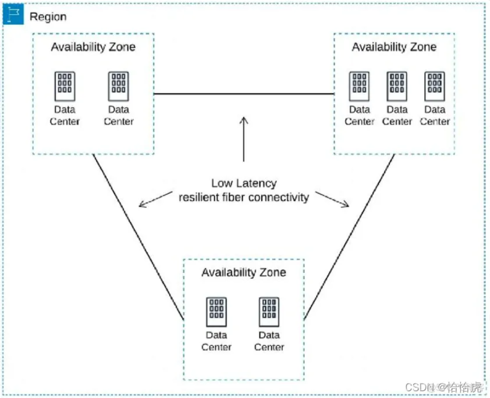
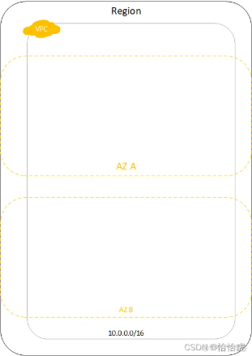
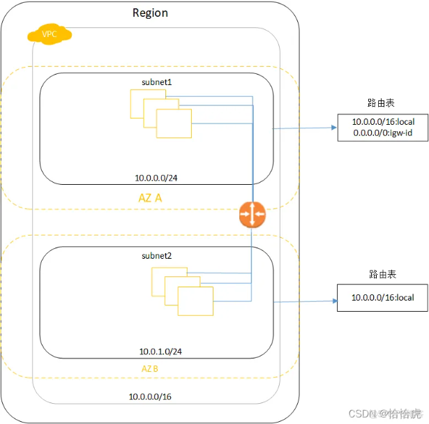
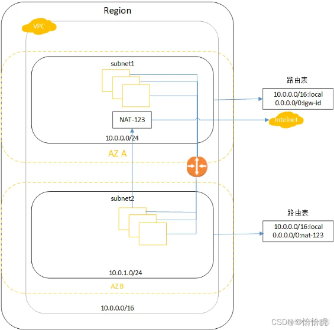

参考：https://blog.51cto.com/u_14172/10047589

AWS的网络及其相关的组件基础知识和架构，其中包括：

-  区域(Region)，可用区(AZ)
-  VPC相关，包括subnet，internet gateway，NAT，网络ACL，security group等
-  负载均衡(ELB)
-  Route 53
-  CloudFront

## 区域(Region)和可用区(AZ)

同一个Region包含多个AZ，AZ的本质就是物理数据中心，每个AZ使用单独的电源和网络设施，这使得AZ之间相互隔离，以便在单个AZ发生故障时最大限度地减少对其他AZ的影响。

同一个Region的AZ之间采用低延时的**专线连接**，实现数据在跨AZ之间的低延迟复制和高可用。需要注意的是，一个AZ可以包含多个数据中心组成。

## VPC

VPC(Virtual Private Cloud )从逻辑层面，将客户的基础设施隔离开，让其所有资源运行在的一个私有网络空间，从用户的角度看，VPC就是自己独有的数据中心。如图所示

一个私有的网络空间，需要定义和选择 VPC 的地址空间（CIDR 范围），可跨多个AZ，不能跨Region，因为region之间没有专线

## 子网与互联网网关

VPC申请完成后，就有了自己的专属"数据中心",接下就需要创建数据中心内部的"隔离区"即子网，比如经常说的“公网”和“私网”。每个子网可以设置自己的CIDR 范围，路由规则，流量转化规则等，如公网可以与外网通讯，私网只能在内网中通讯。如图所示：

该VPC中包含两个子网subnet1和subnet2，两个子网设置不同的路由表，对于subnet1，内部请求走本地连接（10.0.0.0/16:local），其他的流量走互联网网关(0.0.0.0/0:igw-id),所以subnet1是"公网"；对于subnet2，无法路由到互联网出口，其流量只能封闭在VPC内部。

这里有两个概念，路由表和互联网网关。

- 路由表

  一组路由规则组成，确定将网络流量发送到何处。每个 VPC 内，都有一个默认的路由表，只允许流量在本地（VPC 内部）转发。如果要访问外网，就需要创建一个路由表，显式地指定该规则。

- 互联网网关

  该网关连接到互联网，通过配置该网关路由，实现VPC内的资源与外网的通信。一般默认VPC的默认子网都会有互联网网关。

### NAT网关和实例

​      很多情况下，对于"私网"的实例也有连接互联网的需求，比如版本包的下载，AWS提供了NAT网关实现这一需求。如图所示：

subnet1公网中部署NAT网关,如图示的NAT-123，subnet2私网中的实例通过连接该网关，实现对互联网的访问。

NAT网关，位于公有子网的网关服务，负责接收从私有子网发往公网的数据包，转发至其目的地址；同时转发返回的数据包到源地址。
除了NAT网关外，还可以部署NAT实例，基于EC2实例安装AMI镜像，与NAT网关相比，NAT实例的高可用需要通过脚本实现故障转移，维护和弹性扩容需要自行操作；而NAT网关则是由AWS托管。

## 网络ACL和安全组  

**网络访问控制列表（Network Access Control List, NACL）** 

无状态的子网级别的防火墙，可以控制进出 VPC 内各个子网的流量。

它是一个有序规则列表，每个规则都有一个编号，按照从最小到最大的顺序处理

- 无状态：这意味着如果允许入站流量进入子网，则必须显式地允许返回的出站流量。
- 子网级别：NACL 适用于整个子网中的所有实例，不能针对单个实例进行配置。
- 默认规则：每个 NACL 都有一组默认规则，允许所有入站和出站流量。你可以添加或修改这些规则来增强安全性。
- 优先级：规则按数字顺序应用，找到匹配的第一条规则后即停止处理后续规则。

应用场景

- 作为第一道防线：由于 NACL 在子网级别工作，它提供了额外的一层防护，适合用于限制特定子网的流量。
- 防止恶意流量：例如，阻止来自已知不良 IP 地址范围的流量。

**安全组（Security Groups）** 

- 一种虚拟防火墙，用于控制流入和流出 EC2 实例或其他 AWS 资源的流量。
- 实例级别的，意味着你可以为每个实例单独配置不同的安全组。

- **有状态**：如果你允许入站流量，相应的出站响应会自动被允许，无需额外配置。
- **实例级别**：安全组可以针对单个或多个实例进行配置，提供更细粒度的控制。
- **默认拒绝**：除非你明确添加允许规则，否则所有流量都会被拒绝。
- **灵活规则**：支持基于 IP 地址、协议类型、端口号等多种条件来定义规则。

应用场景
细化访问控制：根据应用程序的需求，精确地控制哪些 IP 地址或端口可以访问特定的实例。
动态调整：可以根据需要随时修改安全组规则，而无需重启实例。
