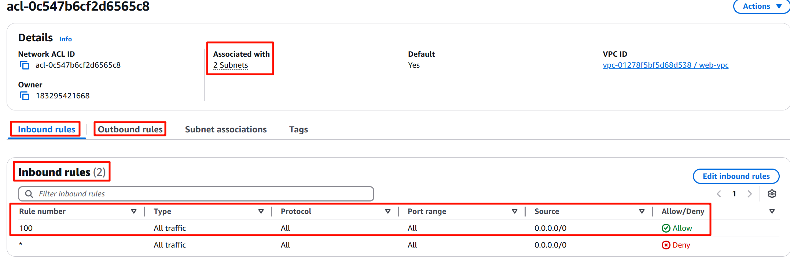
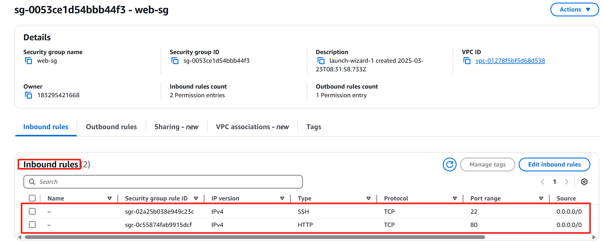
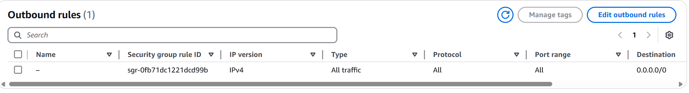
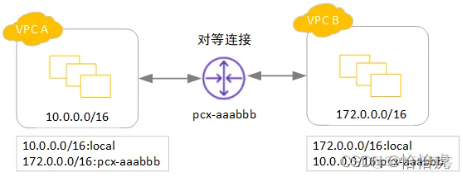
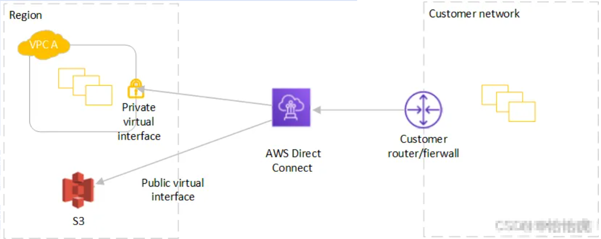
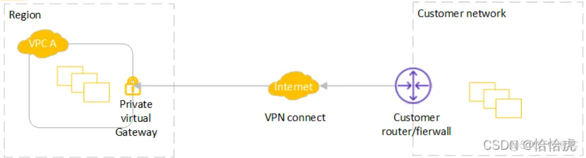

参考：https://blog.51cto.com/u_14172/10047589

AWS的网络及其相关的组件基础知识和架构，其中包括：

-  区域(Region)，可用区(AZ)
-  VPC相关，包括subnet，internet gateway，NAT，网络ACL，security group等
-  负载均衡(ELB)
-  Route 53
-  CloudFront

## 区域(Region)和可用区(AZ)

一个Region包含多个AZ，AZ的本质是物理数据中心，每个AZ使用单独的电源和网络设施，这使得AZ之间相互隔离，以便在单个AZ发生故障时最大限度地减少对其他AZ的影响。

同一个Region的AZ之间采用低延时的**专线连接**，实现数据在跨AZ之间的低延迟复制和高可用。需要注意的是，一个AZ可包含多个数据中心。

## VPC

VPC(Virtual Private Cloud )从逻辑层面，将客户的基础设施隔离开，让其所有资源运行在的一个**私有网络空间**，从用户的角度看，VPC就是自己独有的互联网那个数据中心（IDC）。如图所示

一个VPC是一个私有的网络空间，需要定义和选择 VPC 的地址空间（CIDR 范围），可跨多个AZ，不能跨Region，因为region之间没有专线

### 子网 互联网网关  路由表

VPC申请完成后，就有了自己的私有数据中心,接下就需要创建数据中心内部的"隔离区"即子网，比如经常说的“公网”和“私网”。每个子网可以设置自己的CIDR 范围，路由规则，流量转化规则等，如公网可以与外网通讯，私网只能在内网中通讯。如图所示：

该VPC中包含两个子网subnet1和subnet2，两个子网设置不同的路由表，对于subnet1，内部请求走本地连接（10.0.0.0/16:local），其他的流量走互联网网关(0.0.0.0/0:igw-id),所以subnet1是"公网"；对于subnet2，无法路由到互联网出口，其流量只能封闭在VPC内部。

这里有两个概念，路由表和互联网网关。

- 路由表

  一组路由规则组成，确定将网络流量发送到何处。每个 VPC 内，都有一个默认的路由表，只允许流量在本地（VPC 内部）转发。如果要访问外网，就需要创建一个路由表，显式地指定该规则。

- 互联网网关

  该网关连接到互联网，通过配置该网关路由，实现VPC内的资源与外网通信。一般默认VPC的默认子网都会有互联网网关。

VPC（虚拟私有云）、子网（Subnet）和路由表（Route Table） 之间的核心关系

 (1) VPC与子网 

• 子网是VPC的子集：每个子网必须属于一个VPC，并且其IP地址范围必须是VPC CIDR块的子集（例如VPC的CIDR为 10.0.0.0/16，子网的CIDR可以是 10.0.1.0/24）。

 • 子网划分：根据业务需求，VPC通常划分为多个子网（如公有子网、私有子网、数据库子网），分布于不同可用区以提高高可用性。 

 (2) 子网与路由表 

• **每个子网必须关联一个路由表**： 

​	• 创建子网时，会自动关联VPC的默认路由表（主路由表）。 

​	• 可以手动将子网关联到自定义路由表以实现更细粒度的流量控制。   

• 路由表的路由规则：

​	 • 系统路由：由AWS自动添加（如 本地路由，用于VPC内子网间通信）。

​		 • 自定义路由：由用户添加（如通过互联网网关访问互联网，或通过NAT网关访问外部资源）。  

 • 路由表的复用性： 

​	• 一个路由表可关联多个子网，适合具有相同流量策略的子网（如多个私有子网共用同一路由表）。

​	 • 子网只能关联一个路由表，确保流量规则的唯一性。    

(3) VPC与路由表 

• VPC的默认路由表： 

​	• 每个VPC创建时自动生成一个默认路由表，包含一条本地路由（Destination: 10.0.0.0/16 → Target: local，假设VPC的CIDR是 10.0.0.0/16）。 

​	• 不可删除，但可修改其路由规则。   

• 自定义路由表：

​	• 用户可创建多个自定义路由表，用于不同子网的流量策略（如公有子网与私有子网的路由规则不同）。 

​	• 需要手动关联到子网。

### NAT网关和实例

NAT网关，位于公有子网的网关服务，负责接收从私有子网发往公网的数据包，转发至其目的地址；同时转发返回的数据包到源地址。
除了NAT网关外，还可以部署NAT实例，基于EC2实例安装AMI镜像，与NAT网关相比，NAT实例的高可用需要通过脚本实现故障转移，维护和弹性扩容需要自行操作；而NAT网关则是由AWS托管。

​      很多情况下，对于"私网"的实例也有连接互联网的需求，比如版本包的下载，AWS提供了NAT网关实现这一需求。如图所示：

subnet1公网中部署NAT网关 NAT-123，subnet2私网中的实例通过连接该网关，实现对互联网的访问。

### ACL Security Groups

**网络访问控制列表（Network Access Control List, NACL）** 

ACL 无状态的**子网级别的防火墙**，可以控制进出 VPC 内各个subnet的流量。 1个ACL可应用于多个subnet

它是一个有序规则列表，每个规则都有一个编号，按照从最小到最大的顺序处理

- 无状态：这意味着如果允许入站流量进入子网，则必须显式地允许返回的出站流量。
- 子网级别：NACL 适用于整个子网中的所有实例，不能针对单个实例进行配置。
- 默认规则：每个 NACL 都有一组默认规则，允许所有入站和出站流量。你可以添加或修改这些规则来增强安全性。
- 优先级：规则按数字顺序应用，找到匹配的第一条规则后即停止处理后续规则。

应用场景

- 作为第一道防线：由于 NACL 在子网级别工作，它提供了额外的一层防护，适合用于限制特定子网的流量。
- 防止恶意流量：例如，阻止来自已知不良 IP 地址范围的流量。

**安全组（Security Groups）** 

- 一种**实例级别**的虚拟防火墙，用于控制 流入和流出 EC2实例或其他 AWS 资源的流量。可为每个实例单独配置不同的安全组。

- **有状态**：如果你允许入站流量，相应的出站响应会自动被允许，无需额外配置。
- **实例级别**：安全组可以针对单个或多个实例进行配置，提供更细粒度的控制。
- **默认拒绝**：除非你明确添加允许规则，否则所有流量都会被拒绝。
- **灵活规则**：支持基于 IP 地址、协议类型、端口号等多种条件来定义规则。

应用场景
细化访问控制：根据应用程序的需求，精确地控制哪些 IP 地址或端口可以访问特定的实例。
动态调整：可以根据需要随时修改安全组规则，而无需重启实例。

### 对等连接

当有多个VPC时，VPC之间需要进行连接和通信，这就需要建立VPC的对等连接。如图所示：

  VPC建立对等连接后，两个VPC(可以跨AWS账号)中实例的通信就像在同一个网络中一样，流量一直处于AWS内部网络，不会经过Internet。

对于建立对等连接的VPC有以下的特点：

(1)VPC不能有重复的CIDR块，因为建立VPC对等连接后，就像同一个网络，如果有相同的ip，就会有ip冲突。

(2)VPC对等连接不支持传递(两个VPC之间是一对一的关系)。如图所示：

 VPC A与VPC B，VPC B与VPC C建立对等连接，VPC A 无法通过VPC B来访问 VPC C。如果需要访问，需要再建立VPC A与VPC C之间的连接。

 (3)对等连接是以采用路由的方式，需要手动添加路由。如下图所示：

### 终端节点以及终端节点服务

### Direct Connect 和VPN

 当VPC跨可用区以及跨区域连接，实现内部网络的访问，在物理层面是如何实现的呢？这就是今天要讲的Direct Connect，Direct Connect采用的是光纤直连，使用1Gbps、10Gbps 或 100Gbps专用管道连接到AWS区域。不仅适用于AWS VPC之间，也适用于客户自有的VPC与AWS VPC之间的连接。如图所示：

   AWS端创建公有虚拟接口(对于公有服务)，私有虚拟接口(对于VPC内私有资源)，通过AWS Direct Connect实现同客户网络的出口路由或者防火墙与这些接口的连接。一般情况下，并不是真正拉一条光纤，而是租用网络提供商(比如电信，移动)的专用路由。

   很显然，AWS Direct Connect对于传输安全，稳定性，低延迟，带宽等方面有着很大的优势，但是价格也是不菲的。有些时候，并不需要这么高的要求，比如通过客户私有机房访问AWS VPC，实现一些运维操作，就可以采用另一种方案，即VPN。

  VPN与Direct Connect最大的不同，走的是互联网，延迟和稳定性都要逊于 Direct Connect，如图所示。

## 负载均衡

一般用来实现流量的均衡，故障转移，安全控制，卸载证书等，常见的有硬件负载均衡F5，软件的有LVS，Nginx等。我们看下功能：

AWS提供三种主要类型的负载均衡器：

|            | ALB                                                   | NLB                                                          | CLB                                               |
| ---------- | ----------------------------------------------------- | ------------------------------------------------------------ | ------------------------------------------------- |
| 支持的协议 | HTTP ， HTTPS，WebSocket                              | TCP，UDP                                                     | HTTP(不包括http2)，HTTPS，TCP                     |
| 路由规则   | 默认是轮询路由，可以配置按规则路由，如指定url路径路由 | 按照五元组和TCP序列号哈希后路由，连接有效期可保持路由到同一个目标 | TCP，轮询路由HTTP，HTTPS，最少未完成请求路由算法  |
| 跨区域     | 默认启用状态                                          | 默认禁用状态                                                 | 取决于使用方式，API，CLI默认禁止，console默认开启 |
