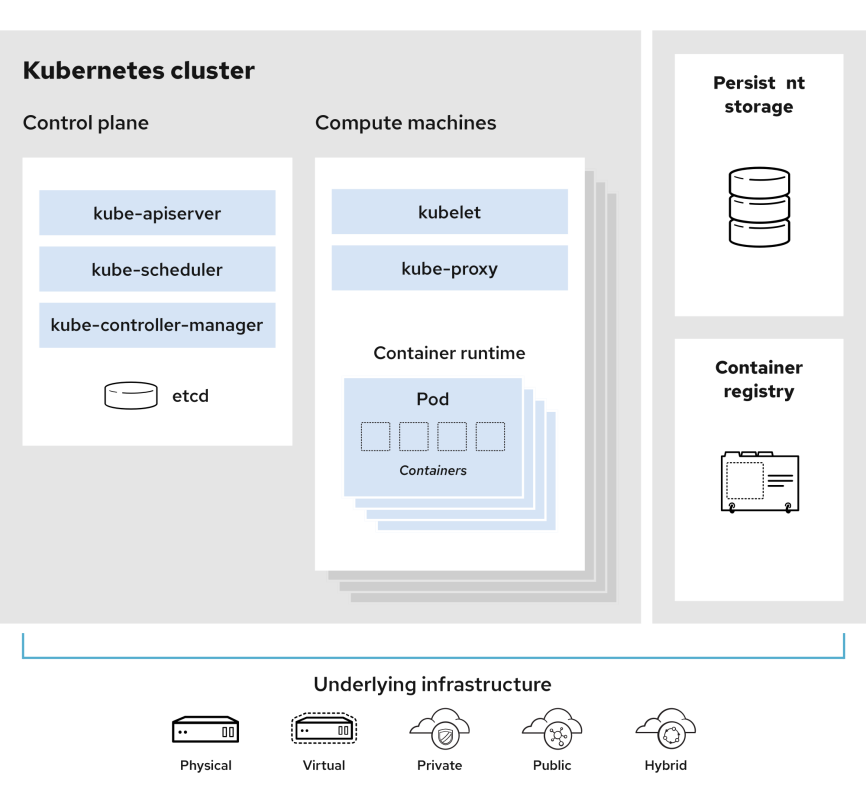
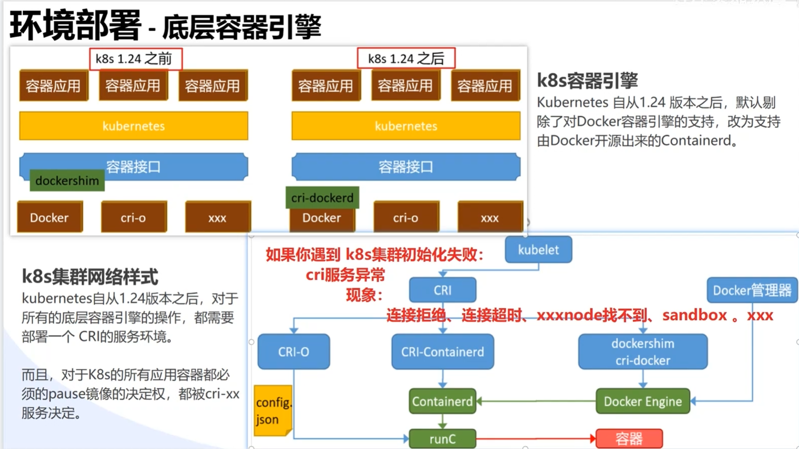
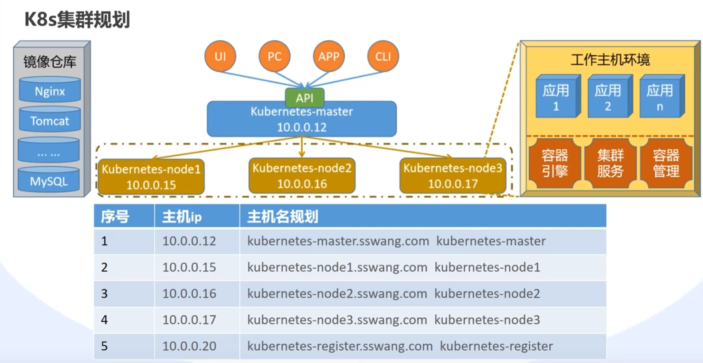
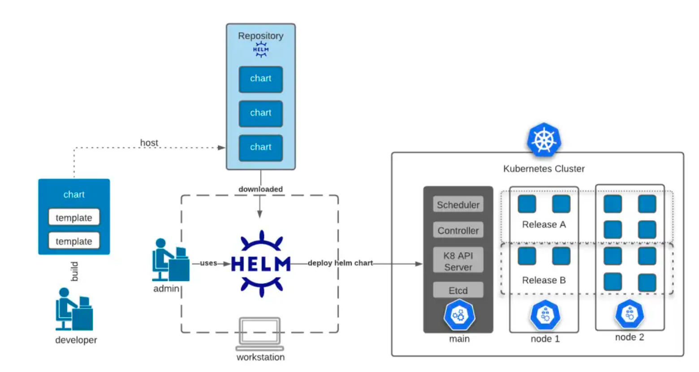
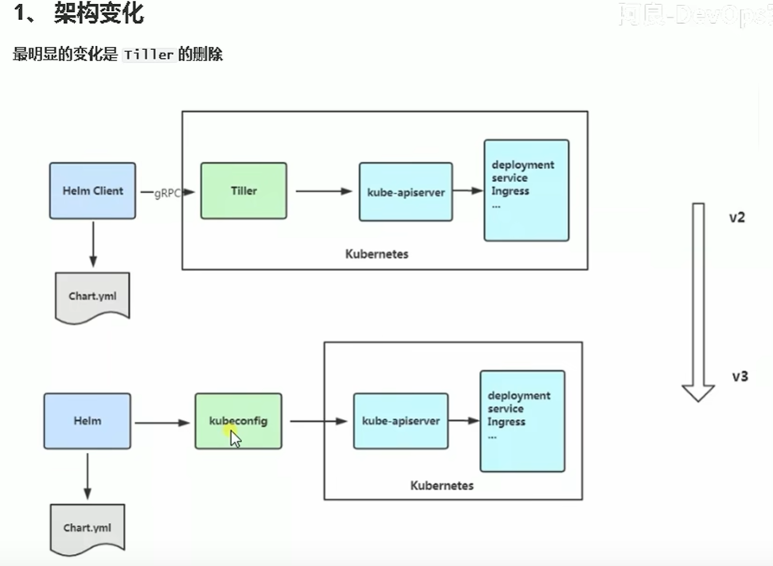

# k8s 集群的架构和原理

可参考https://zhuanlan.zhihu.com/p/654662196

---



## 一、核心架构

k8s 集群由 **Master 控制平面** 和 **Worker 节点** 组成，遵循 声明式API 和 控制器模式。

控制器模式则是 k8s 实现声明式 API 的核心机制。控制器不断监控集群状态，当实际状态与期望状态不符时，自动进行调整，确保集群始终处于预期状态 。

### 1. Master 节点组件
- **API Server（kube-apiserver）**   默认端口 6443
  
  - K8S API，集群统一入口(gataway)，以RESTful提供接口服务(包括认证授权、数据校验以及集群状态变更)，各组件协调者，所有资源的增删改查和监听操作都交给APIServer处理后再提交给etcd存储。
  - 负责 认证、授权、请求校验，并将状态持久化到 etcd。  
  
- **etcd**  
  - 分布式键值存储，保存集群所有资源的当前状态。  
  - 使用 Raft 协议保证一致性。  

- **Controller Manager（kube-controller-manager）**  
  
  - 运行多种控制器，通过**控制循环**确保实际状态与期望状态一致。  
  - **控制循环是 k8s 实现自动化的核心机制**，通过持续observe、analyze、act和loop，确保系统始终朝着用户定义的期望状态收敛
  
- **Scheduler（kube-scheduler）**  
  - 负责分配调度 Pod 到集群内的节点上，它监听 kube-apiserver，查询还未分配 Node 的 Pod，然后根据调度策略为这些 Pod 分配节点（更新 Pod 的 NodeName 字段）。

  调度分为两个阶段，predicate 和 priority
  1）predicate：过滤不符合条件的节点
  2）priority：优先级排序，选择优先级最高的节点

### 2. Worker 节点组件
- **kubelet**  端口 10250
  
  - kubelet是Master在Node节点上的Agent，管理本机运行容器的生命周期，比如创建容器、Pod挂载数据卷、下载Secret、获取容器节点状态工作。
  
    每个节点上都运行一个 kubelet 服务进程，默认监听 10250 端口，接收并执行 master 发来的指令，管理 Pod 及 Pod 中的容器。每个 kubelet 进程会在 API Server 上注册节点自身信息，定期向 master 节点汇报节点的资源使用情况，并通过 cAdvisor 监控节点和容器的资源。
  
- **kube-proxy**  
  - 在node节点上实现Pod网络代理，维护网络规则和四层负载均衡工作。
    每台机器上都运行一个 kube-proxy 服务，它监听 API server 中 service 和 endpoint 的变化情况，并通过 iptables 等来为服务配置负载均衡（仅支持 TCP 和 UDP）。
    kube-proxy 可以直接运行在物理机上，也可以以 static pod 或者 daemonset 的方式运行。
  
- **容器运行时**  
  - 如 docker、containerd、CRI-O，通过 CRI 接口与 kubelet 交互。  

---

## 二、关键交互机制
### 1. API Server 的核心作用
- 所有组件通过 **Watch 机制** 监听资源变化。  
- 组件之间通过 API Server 中介通信。  

### 2. 控制器的工作原理
- **控制循环（Reconcile Loop）**  
  - 比较 `spec` 和 `status`，触发调谐逻辑。  

### 3. etcd 的角色
- 资源对象以键值形式存储（如 `/registry/pods/<namespace>/<pod-name>`）。  


## 三、**网络模型**

#### 1. **Pod 网络**

- 每个 Pod 拥有独立 IP（IP-per-Pod），**跨节点通信**需通过 CNI（Container Network Interface）插件（如 Calico、Flannel）。
- 同一 Pod 内容器共享网络命名空间，通过 `localhost` 通信。

#### 2. **Service 网络**

- **Service** 提供稳定的虚拟 IP（ClusterIP），通过标签选择器关联后端 Pod。
- **kube-proxy** 实现流量转发：
  - iptables 模式：基于规则链匹配目标 IP 和端口。
  - IPVS 模式：使用内核级负载均衡，适合大规模集群。

#### 3. **Ingress**

- 通过 Ingress Controller（如 Nginx、Traefik）暴露 HTTP/HTTPS 服务，支持路径路由和 TLS 终止。

------

## 四、**存储设计**

#### 1. **Volume**

- 临时卷（emptyDir）与持久卷（PersistentVolume，PV）。
- **PersistentVolumeClaim（PVC）**：用户通过 PVC 申请存储资源，由 StorageClass 动态供给或静态绑定。

#### 2. **CSI（Container Storage Interface）**

- 标准化插件接口，允许第三方存储系统（如 AWS EBS、Ceph）集成到 k8s。

------

## 五、**调度与资源管理**

#### 1. **调度流程**

- **预选（Predicates）**：过滤不满足条件的节点（如资源不足）。
- **优选（Priorities）**：对节点打分（如资源利用率、亲和性），选择最优节点。

#### 2. **资源限制**

- 通过 `requests` 和 `limits` 定义 CPU/内存的请求和上限，影响调度和 QoS 等级（Guaranteed、Burstable、BestEffort）。

#### 3. **高级调度策略**

- 节点亲和性（Node Affinity）、Pod 亲和性/反亲和性（Pod Anti-Affinity）。
- 污点和容忍（Taints and Tolerations）：限制 Pod 调度到特定节点。

------

## 六、**安全机制**

#### 1. **认证（Authentication）**

- 支持 X509 客户端证书、Bearer Token、ServiceAccount 等方式。

#### 2. **授权（Authorization）**

- RBAC（Role-Based Access Control）：通过 Role 和 RoleBinding 定义权限。

#### 3. **准入控制（Admission Control）**

- 动态准入 Webhook：在资源持久化前修改或验证请求（如 Pod 安全策略）。

------

## 七、**扩展机制**

#### 1. **CRD（Custom Resource Definition）**

- 自定义资源类型（如 `CronTab`），扩展 k8s API。

#### 2. **Operator 模式**

- 结合 CRD 和控制器，实现应用生命周期管理（如 etcd Operator）。

------

## 八、**调试与故障排查**

1. **查看组件日志**：
   - Master 组件：`kube-apiserver`、`kube-controller-manager`、`kube-scheduler`。
   - Worker 组件：`kubelet`、`kube-proxy`。
2. **使用 `kubectl` 工具**：
   - `kubectl describe`：查看资源详细状态和事件。
   - `kubectl logs`：获取容器日志。
   - `kubectl exec`：进入容器调试。
3. **检查网络连通性**：
   - 使用 `nslookup`、`curl` 验证 DNS 和 Service 访问

---

## 九、实践建议
1. **手动搭建集群**：使用 `kubeadm` 或二进制部署。  
2. **阅读官方文档**：  
   - [k8s 架构](https://k8s.io/docs/concepts/overview/components/)  
   - [设计文档](https://github.com/k8s/community/tree/master/contributors/design-proposals)  
3. **源码分析**：研究核心控制器逻辑。  

# k8S

k8s is an open source **container orchestration engine** for automating deployment, scaling, and management of containerized applications. 

## 部署方式

1. 传统的**服务进程**    手工繁琐，需使用自动化工具 ansible/saltstack/shell

2. 容器应用管理     应用功能状态最大化封装

   


​												传统二进制	  																					kubeadm


## 网络架构


## 容器引擎




## pod创建方式及流程

**方式**

**命令行**      kubectl run podName --image=nginx:1.24  

**yaml**   kubectl apply -f my-pod.yaml

```yaml
apiVersion: v1
kind: Pod
metadata:
  name: my-pod
spec:
  containers:
    - name: nginx-container
      image: nginx:1.21
```

**流程**

1 k8s API Server 接收请求
	执行 kubectl apply 命令时，kubectl 将 YAML >> JSON 格式，通过 REST API 发送到 API Server。
	API Server 验证请求的有效性（如权限检查、资源定义的合法性等）。

2 API Server 处理请求

- 接收 JSON 格式的请求。
- 将 JSON 数据转换为 Go 结构体。
- 将 Go 结构体序列化为 Protobuf 格式。

​	API Server 将接收到的资源对象存储到 etcd 中.
​	API Server 还会通知所有相关的控制器（Controller），告知有一个新的 Pod 被创建。
3 调度器（Scheduler）选择节点
​	调度器（Scheduler）负责将新创建的 Pod 分配到合适的节点上。
​	调度器会考虑多种因素，包括节点的资源可用性（CPU、内存等）、亲和性和反亲和性规则、污点和容忍等。
4 Kubelet 拉取镜像并启动容器
​	当调度器决定将 Pod 分配给某个节点后，该节点上的 Kubelet 组件会收到通知。
​		Kubelet 通过 CRI(cri-dockerd) 调用Container Runtime从指定的镜像仓库（例如 Docker Hub）拉取 nginx:1.21 镜像。
​		拉取完成后，Kubelet 使用Container Runtime（如 containerd 或 Docker）启动容器。
5 健康检查和状态更新
​	容器启动后，Kubelet 会定期进行健康检查（如果配置了 Liveness 和 Readiness Probes）。
​	如果一切正常，Pod 的状态会被更新为 Running，并且可以通过 kubectl get pods 查看到。
6 访问 Pod
​	如果需要访问这个 Pod，可以通过端口转发或服务（Service）的方式进行访问：
​	使用 kubectl port-forward 命令进行本地端口转发：
​	kubectl port-forward pod/my-pod 8080:80
​	或者创建一个 Service 来暴露 Pod。

```
+---------------------+
| Prepare YAML File   |
+----------+----------+
           |
           v
+----------+----------+
| Apply YAML with     |
| kubectl apply -f    |
+----------+----------+
           |
           v
+----------+----------+
| API Server Receives |
| and Validates       |
+----------+----------+
           |
           v
+----------+----------+
| Store in etcd       |
+----------+----------+
           |
           v
+----------+----------+
| Notify Controllers  |
+----------+----------+
           |
           v
+----------+----------+
| Scheduler Selects   |
| Node                 |
+----------+----------+
           |
           v
+----------+----------+
| Kubelet on Node     |
| Pulls Image and     |
| Starts Container    |
+----------+----------+
           |
           v
+----------+----------+
| Health Checks and   |
| Status Updates      |
+----------+----------+
           |
           v
+----------+----------+
| Access Pod via Port |
| Forwarding or       |
| Service             |
+---------------------+

当你运行 kubectl apply -f nginx-deployment.yml 命令时，Kubernetes 集群中的多个组件会协同工作来处理这个请求。以下是详细的执行流程，包括各个组件的角色和它们之间的交互。

1. 客户端（kubectl）
1.1 解析 YAML 文件
读取文件：kubectl 读取并解析 nginx-deployment.yml 文件。
验证格式：检查文件的格式是否正确，并确认其定义了一个有效的 Kubernetes 资源对象（例如 Deployment）。
1.2 发送请求到 API Server
序列化为 JSON：将 YAML 文件的内容转换为 JSON 格式。
构造 HTTP 请求：构建一个 HTTP POST 请求，包含资源对象的 JSON 数据。
发送请求：通过 HTTPS 协议将请求发送到 Kubernetes API Server。
2. API Server
2.1 接收请求
身份验证：API Server 首先对请求进行身份验证，确保请求来自合法用户或服务账户。
授权检查：检查该用户是否有权限执行 apply 操作。这通常涉及到 RBAC（基于角色的访问控制）策略。
2.2 解析和验证资源对象
反序列化：将接收到的 JSON 数据反序列化为 Go 结构体。
模式验证：验证资源对象的结构是否符合 Kubernetes 的 API 规范。例如，检查 apiVersion, kind, metadata, spec 等字段是否存在且格式正确。
准入控制：API Server 还会调用一系列的准入控制器（Admission Controllers），这些控制器可以对资源对象进行进一步的修改或验证。常见的准入控制器包括：
NamespaceLifecycle：确保命名空间存在且未被终止。
LimitRanger：确保资源请求和限制在允许范围内。
ResourceQuota：检查是否超过了命名空间的资源配额。
MutatingAdmissionWebhook 和 ValidatingAdmissionWebhook：允许自定义 Webhook 对资源对象进行修改或验证。
2.3 存储资源对象
存储到 etcd：如果所有验证都通过，API Server 将资源对象序列化为 Protobuf 格式，并将其存储到 etcd 中。
生成事件：API Server 会生成相应的事件（Events），记录资源对象的状态变化。
3. Controller Manager
3.1 监听资源变化
控制器循环：Controller Manager 包含多个控制器（Controllers），每个控制器负责管理特定类型的资源对象。例如，Deployment 控制器负责管理 Deployment 资源。
监听 API Server：控制器通过与 API Server 的 watch 机制监听资源的变化。当一个新的 Deployment 被创建时，Deployment 控制器会收到通知。
3.2 处理资源对象
创建 ReplicaSet：对于 Deployment 资源，控制器会根据 spec.replicas 字段创建相应的 ReplicaSet 资源。
更新状态：控制器会更新 Deployment 资源的状态字段（如 observedGeneration, replicas, updatedReplicas, readyReplicas 等），以反映当前的状态。
4. Scheduler
4.1 监听 Pod 创建
监听 API Server：Scheduler 通过与 API Server 的 watch 机制监听未调度的 Pod 资源（即那些 spec.nodeName 字段为空的 Pod）。
选择节点：当 Scheduler 收到新的 Pod 创建请求时，它会根据一系列调度算法选择一个合适的节点来运行该 Pod。这些算法包括：
预选（Predicates）：过滤掉不满足条件的节点（如资源不足、标签不符合等）。
优选（Priorities）：为剩余的节点打分，选择得分最高的节点。
4.2 绑定 Pod 到节点
绑定操作：一旦选择了合适的节点，Scheduler 会向 API Server 发出请求，将 Pod 的 spec.nodeName 字段设置为所选节点的名称。这样就完成了 Pod 的调度过程。
5. Kubelet
5.1 监听节点上的 Pod 变化
监听 API Server：Kubelet 通过与 API Server 的 watch 机制监听分配给本节点的 Pod 资源。
启动容器：
下载镜像：如果需要运行的容器镜像不在本地缓存中，Kubelet 会从指定的镜像仓库下载镜像。
创建容器：使用容器运行时（如 containerd 或 Docker）创建并启动容器。
健康检查：Kubelet 会定期执行存活探针（Liveness Probes）和就绪探针（Readiness Probes），以确保容器处于健康状态。
6. 网络插件（CNI）
6.1 配置 Pod 网络
分配 IP 地址：网络插件负责为新创建的 Pod 分配 IP 地址，并配置网络接口。
网络隔离：实现 Pod 之间的网络隔离和通信规则。
7. 监控和日志收集
7.1 日志收集
容器日志：容器运行时会将容器的标准输出和标准错误流重定向到文件系统中的某个位置。Kubelet 或专门的日志收集工具（如 Fluentd 或 Filebeat）会定期收集这些日志并发送到集中式的日志管理系统（如 Elasticsearch 或 Loki）。
7.2 监控
Metrics Server：集群中的 Metrics Server 会定期从 Kubelet 收集节点和 Pod 的性能指标（如 CPU 使用率、内存使用量等），并将这些数据暴露给 API Server。
Prometheus/Grafana：许多集群会使用 Prometheus 和 Grafana 来收集和可视化这些性能指标，以便于监控和报警。
示例流程
假设你有一个简单的 nginx-deployment.yml 文件：

Yaml
深色版本
apiVersion: apps/v1
kind: Deployment
metadata:
  name: nginx-deployment
  labels:
    app: nginx
spec:
  replicas: 3
  selector:
    matchLabels:
      app: nginx
  template:
    metadata:
      labels:
        app: nginx
    spec:
      containers:
      - name: nginx
        image: nginx:1.14.2
        ports:
        - containerPort: 80
以下是详细的执行流程：

kubectl：
读取并解析 nginx-deployment.yml 文件。
将 YAML 文件转换为 JSON 格式。
构造 HTTP POST 请求，将 JSON 数据发送到 API Server。
API Server：
对请求进行身份验证和授权。
验证资源对象的格式和内容。
调用准入控制器进行进一步的验证和修改。
将资源对象序列化为 Protobuf 格式并存储到 etcd 中。
Controller Manager：
Deployment 控制器监听到新的 Deployment 资源。
根据 spec.replicas 字段创建相应的 ReplicaSet 资源。
更新 Deployment 资源的状态字段。
Scheduler：
监听到新的 Pod 资源（由 ReplicaSet 创建）。
选择合适的节点来运行这些 Pod。
向 API Server 发出请求，将 Pod 绑定到选定的节点。
Kubelet：
监听到分配给本节点的 Pod 资源。
下载所需的容器镜像并启动容器。
定期执行健康检查，确保容器处于健康状态。
网络插件（CNI）：
为新创建的 Pod 分配 IP 地址。
配置网络接口，确保 Pod 之间的网络通信正常。
监控和日志收集：
收集容器的日志并发送到集中式的日志管理系统。
收集性能指标并暴露给 API Server，供监控工具使用。

总结
kubectl apply -f nginx-deployment.yml 的执行流程涉及多个 Kubernetes 组件的协同工作：

kubectl：负责读取和解析 YAML 文件，并将其发送到 API Server。
API Server：负责身份验证、授权、验证资源对象，并将其存储到 etcd 中。
Controller Manager：监听资源变化，创建相应的子资源（如 ReplicaSet）并更新状态。
Scheduler：选择合适的节点来运行 Pod，并将 Pod 绑定到节点。
Kubelet：负责在节点上启动容器，并执行健康检查。
网络插件（CNI）：配置 Pod 的网络，确保网络通信正常。
监控和日志收集：收集日志和性能指标，供后续分析和监控使用。
```

## kubeadm部署



### 主机名规划

| 序号 | 主机ip          | 主机名规划                           |
| ---- | --------------- | ------------------------------------ |
| 1    | 192.168.101.120 | k8s-master.sswang.com k8s-master     |
| 2    | 192.168.101.121 | k8s-node1.sswang.com k8s-node1       |
| 3    | 192.168.101.122 | k8s-node2.sswang.com k8s-node2       |
| 4    | 192.168.101.123 | k8s-node3.sswang.com k8s-node3       |
| 5    | 192.168.101.124 | k8s-register.sswang.com k8s-register |

### 跨主机免密码认证

```sh
生成秘钥对
ssh-keygen -t rsa 

跨主机免密码认证
ssh-copy-id root@192.168.101.121
ssh-copy-id root@192.168.101.122
ssh-copy-id root@192.168.101.123
ssh-copy-id root@192.168.101.124
```

### master安装ansible

```shell
yum install -y epel-release ansible

vim /etc/ansible/hosts
#添加test group
[test]
192.168.101.121
192.168.101.122
192.168.101.123
192.168.101.124

echo '192.168.101.120 k8s-master.sswang.com k8s-master
192.168.101.121 k8s-node1.sswang.com k8s-node1
192.168.101.122 k8s-node2.sswang.com k8s-node2
192.168.101.123 k8s-node3.sswang.com k8s-node3
192.168.101.124 k8s-register.sswang.com k8s-register'  >> /etc/hosts

# echo "test" |  tee -a /etc/hosts 
# tee将字符串写入指定的文件 -a append 

ansible test -m copy   -a "src=/etc/hosts dest=/etc/hosts"
ansible test -m shell  -a "reboot"
```


```sh
#临时禁用swap
swapoff -a

#内核参数调整
cat >> /etc/sysctl.d/k8s.conf << EOF
vm.swappiness=0
EOF

#网络参数调整
cat >> /etc/sysctl.d/k8s.conf << EOF
net.bridge.bridge-nf-call-ip6tables = 1
net.bridge.bridge-nf-call-iptables = 1
net.ipv4.ip_forward = 1
EOF

#配置生效
modprobe br_netfilter
modprobe overlay

sysctl -p /etc/sysctl.d/k8s.conf

#将/etc/sysctl.d/k8s.conf传输到test集群节点
ansible test -m copy -a  "src=/etc/sysctl.d/k8s.conf  dest=/etc/sysctl.d/k8s.conf"
ansible test -m shell  -a "modprobe br_netfilter"
ansible test -m shell  -a "modprobe overlay"
ansible test -m shell  -a "sysctl -p /etc/sysctl.d/k8s.conf"
```


### docker安装

```sh
#设置Docker的安装环境：首先安装yum-utils工具，然后通过yum-config-manager添加Docker的官方仓库
sudo yum install -y yum-utils
sudo yum-config-manager --add-repo https://download.docker.com/linux/centos/docker-ce.repo

#To install a specific version, start by listing the available versions in the repository
yum list docker-ce --showduplicates | sort -r


#指定版本 <tag>替换为对应版本
#sudo yum install docker-ce-<tag> docker-ce-cli-<tag> containerd.io docker-buildx-plugin docker-compose-plugin
yum install docker-ce-20.10.9 docker-ce-cli-20.10.9 containerd.io docker-buildx-plugin docker-compose-plugin -y 

#最新版
yum install docker-ce docker-ce-cli containerd.io docker-buildx-plugin docker-compose-plugin -y

#配置阿里云镜像源 除了安装harbor的机器都执行
mkdir -p /etc/docker
tee /etc/docker/daemon.json <<-'EOF'
{
  "registry-mirrors": [
    "http://74f21445.m.daocloud.io",
    "https://registry.docker-cn.com",
    "http://hub-mirror.c.163.com",
    "https://docker.mirrors.ustc.edu.cn"
  ],
  "insecure-registries": [
    "k8s-register.sswang.com"
  ],
  "exec-opts": [
    "native.cgroupdriver=systemd"
  ]
}
EOF

systemctl start docker
systemctl enable docker
```


### cri部署

```sh
#方式一 rpm 本次采用
mkdir /data/softs -p && cd /data/softs
rpm -ivh cri-dockerd-0.3.12-3.el7.x86_64.rpm

vim /usr/lib/systemd/system/cri-docker.service
#加上--pod-infra-container-image=k8s-register.sswang.com/google_containers/pause:3.9（需确保可以访问harbor）否则无法创建pod 或者 加上registry.aliyuncs.com/google_containers/pause:3.9
ExecStart=/usr/bin/cri-dockerd --pod-infra-container-image=registry.aliyuncs.com/google_containers/pause:3.9


#启动
systemctl daemon-reload && systemctl enable cri-docker.socket
systemctl start cri-docker.socket cri-docker.service


/usr/lib/systemd/system/cri-docker.socket
```


方式二

```shell
mkdir /data/softs -p && cd /data/softs
wget https://github.com/Mirantis/cri-dockerd/releases/download/v0.3.2/cri-dockerd-0.3.2.amd64.tgz

解压软件
tar xf cri-dockerd-0.3.2.amd64.tgz
mv cri-dockerd/cri-dockerd /usr/local/bin/

检查效果
cri-dockerd --version
```


vim /etc/systemd/system/cri-dockerd.service

```shell
[Unit]
Description=CRI Interface for Docker Application Container Engine
Documentation=https://docs.mirantis.com
After=network-online.target firewalld.service docker.service
Wants=network-online.target

[Service]
Type=notify
ExecStart=/usr/local/bin/cri-dockerd --pod-infra-container-image=k8s-register.sswang.com/google_containers/pause:3.9 --network-plugin=cni --cni-conf-dir=/etc/cni/net.d --cni-bin-dir=/opt/cni/bin --container-runtime-endpoint=unix:///var/run/cri-dockerd.sock --docker-endpoint=unix:///var/run/docker.sock --cri-dockerd-root-directory=/var/lib/docker
ExecReload=/bin/kill -s HUP
TimeoutSec=0
RestartSec=2
Restart=always
StartLimitBurst=3
StartLimitInterval=60s
LimitNOFILE=infinity
LimitNPROC=infinity
LimitCORE=infinity
TasksMax=infinity
Delegate=yes
KillMode=process

[Install]
WantedBy=multi-user.target
cat > /etc/systemd/system/cri-dockerd.socket <<-EOF
[Unit]
Description=CRI Docker Socket for the API
PartOf=cri-docker.service

[Socket]
ListenStream=/var/run/cri-dockerd.sock
SocketMode=0660
SocketUser=root
SocketGroup=docker

[Install]
WantedBy=sockets.target
EOF
```


## harbor构建 (仅在124上执行)

```sh
# docker compose install
curl -SL https://github.com/docker/compose/releases/download/v2.17.2/docker-compose-linux-x86_64 -o /usr/local/bin/docker-compose
chmod +x /usr/local/bin/docker-compose


mkdir /data/{softs,server} -p && cd /data/softs 
wget https://github.com/goharbor/harbor/releases/download/v2.5.0/harbor-offline-installer-v2.5.0.tgz 
tar -zxvf harbor-offline-installer-v2.5.0.tgz -C /data/server/ 
cd /data/server/harbor/ 
docker load < harbor.v2.5.0.tar.gz 
docker images 
#备份配置 
cp harbor.yml.tmpl harbor.yml
#修改配置
[root@k8s-register /data/server/harbor]# vim harbor.yml

# 修改主机名
hostname: k8s-register.sswang.com
http:
  port: 80
#https:  注释ssl相关的部分
  #  port: 443
  #  certificate: /your/certificate/path
  #  private_key: /your/private/key/path
# 默认harbor的登录密码
harbor_admin_password:  Harbor12345

# 设定harbor的数据存储目录
data_volume: /data/server/harbor/data

#配置harbor 
./prepare 

#启动harbor 
./install.sh 

#检查效果
docker-compose ps
```


以下harbor服务暂未使用，需要请自行使用

```sh
vim /etc/systemd/system/harbor.service
[Unit]
Description=Harbor
After=docker.service systemd-networkd.service systemd-resolved.service
Requires=docker.service
Documentation=http://github.com/vmware/harbor

[Service]
Type=simple
Restart=on-failure
RestartSec=5
#需要注意harbor的安装位置
ExecStart=/usr/local/bin/docker-compose --file /data/server/harbor/docker-compose.yml up
ExecStop=/usr/local/bin/docker-compose --file /data/server/harbor/docker-compose.yml down

[Install]
WantedBy=multi-user.target


加载服务配置文件
systemctl daemon-reload
该命令 只会 重新加载配置文件，而不会 重启或停止正在运行的服务。这意味着，如果你更改了服务的配置文件，你需要使用其他命令（如 systemctl restart<service>）来重启服务，以使新的配置生效。

启动服务
systemctl start harbor
检查状态
systemctl status harbor
设置开机自启动
systemctl enable harbor
```


harbor仓库测试

```sh
harbor 创建 用户vj 
用户vj  创建 项目k8s为公开项目

登录仓库
docker login k8s-register.sswang.com -u vj
Password:   # 输入登录密码 159357qQ！

下载镜像
docker pull busybox

定制镜像标签
docker tag busybox k8s-register.sswang.com/vj/busybox:v0.1
docker tag busybox harbor域名    			 /仓库/镜像:tag

推送镜像
docker push k8s-register.sswang.com/vj/busybox:v0.1

从集群中的其他节点上拉取镜像
docker pull k8s-register.sswang.com/vj/busybox:v0.1
```


## Installing kubeadm

https://v1-27.docs.k8s.io/docs/setup/production-environment/tools/kubeadm/install-kubeadm/

K8s集群初始化

**软件源定制-安装软件--镜像获取--主节点初始-工作节点加入集群**

```sh
#软件源定制
cat > /etc/yum.repos.d/k8s.repo << EOF
[k8s]
name=k8s
baseurl=https://mirrors.aliyun.com/k8s/yum/repos/k8s-el7-x86_64
enabled=1
gpgcheck=0
repo_gpgcheck=0
gpgkey=https://mirrors.aliyun.com/k8s/yum/doc/yum-key.gpg https://mirrors.aliyun.com/k8s/yum/doc/rpm-package-key.gpg
EOF

#更新软件源
yum makecache fast
```


```sh
# 安装软件
#所有节点安装 kubeadm kubelet kubectl
yum install -y kubeadm kubelet kubectl
yum remove  -y kubeadm kubelet kubectl

kubeadm version
kubelet --version
kubectl version

#检查镜像文件列表 k8s运行所需镜像 
kubeadm config images list

#镜像获取 只在master执行
vim get-kubeadm-images.sh
images=$(kubeadm config images list | awk -F "/" '{print $NF}')
for i in ${images}
do
  docker pull registry.aliyuncs.com/google_containers/$i
  docker tag registry.aliyuncs.com/google_containers/$i k8s-register.sswang.com/google_containers/$i
  docker push k8s-register.sswang.com/google_containers/$i
  docker rmi registry.aliyuncs.com/google_containers/$i
done


chmod +x get-kubeadm-images.sh
./get-kubeadm-images.sh

docker images
```


master节点初始化

```
kubeadm init --apiserver-advertise-address=192.168.101.120 \
      --image-repository=k8s-register.sswang.com/google_containers \
      --service-cidr=10.96.0.0/12 \
      --pod-network-cidr=10.244.0.0/16 \
      --ignore-preflight-errors=Swap \
      --cri-socket=unix:///var/run/cri-dockerd.sock \
      --v=5
```

node节点加入集群

```sh
# Then you can join any number of worker nodes by running the following on each as root:
kubeadm join 192.168.101.120:6443 --token q59806.z4krgs4h1yp13qjr --discovery-token-ca-cert-hash sha256:b4051b7389188882a46ed8e20dff4199adee93097d2a89641fba66eb3b2bbb6c --cri-socket=unix:///var/run/cri-dockerd.sock
```


```sh
#安装失败后可能用到的命令
yum install lsof -y
sudo kill $(sudo lsof -t -i :6443) $(sudo lsof -t -i :10259) $(sudo lsof -t -i :10257) $(sudo lsof -t -i :10250)&&$(sudo lsof -t -i :2380)&&$(sudo lsof -t -i :2379)&&
sudo rm /etc/k8s/manifests/kube-apiserver.yaml&&
sudo rm /etc/k8s/manifests/kube-controller-manager.yaml&&
sudo rm /etc/k8s/manifests/kube-scheduler.yaml&&
sudo rm /etc/k8s/manifests/etcd.yaml&&
sudo rm -rf /var/lib/etcd/*

%s/192.168.101.12/192.168.101.121/g
```


## 自动补全功能 别名

```sh
yum -y install bash-completion
source /usr/share/bash-completion/bash_completion
echo 'source <(kubectl completion bash)' >>  ~/.bashrc
echo "source <(kubeadm completion bash)" >> ~/.bashrc 
echo "alias k='kubectl'" >> ~/.bashrc
echo 'complete -F __start_kubectl k' >> ~/.bashrc
source ~/.bashrc

echo 'source <(docker completion bash)' >> ~/.bashrc
echo 'source <(helm completion bash)' >> ~/.bashrc
source ~/.bashrc
```

## 网络插件安装

```sh
#Flannel是一个网络规划服务。主要功能是让集群中的不同节点主机创建的Docker容器都具有全集群唯一的虚拟IP地址。这样，即使容器在不同的主机上运行，它们之间也可以像在同一个网络中一样进行通信。
mkdir /data/k8s/flannel -p
cd /data/k8s/flannel/
wget https://github.com/flannel-io/flannel/releases/latest/download/kube-flannel.yml
cp kube-flannel.yml kube-flannel.yml-bak

docker pull flannel/flannel:v0.25.1
docker pull flannel/flannel-cni-plugin:v1.4.0-flannel1

docker tag flannel/flannel:v0.25.1  k8s-register.sswang.com/vj/flannel:v0.25.1
docker tag flannel/flannel-cni-plugin:v1.4.0-flannel1 k8s-register.sswang.com/vj/flannel-cni-plugin:v1.4.0-flannel1

docker push k8s-register.sswang.com/vj/flannel:v0.25.1
docker push k8s-register.sswang.com/flannel/flannel:v0.25.1
vim kube-flannel.yml #修改镜像地址为harbor中的镜像
grep image: kube-flannel.yml
kubectl apply -f kube-flannel.yml
#The connection to the server localhost:8080 was refused - did you specify the right host or port?
ansible test -m copy -a "src=/etc/k8s/admin.conf dest=/etc/k8s/admin.conf"
ansible test -m command -a "echo 'export KUBECONFIG=/etc/k8s/admin.conf' >> ~/.bash_profile"
ansible test -m shell -a "source ~/.bash_profile"
systemctl is-active docker cri-docker kubelet
systemctl enable docker cri-docker kubelet
```


## 整体架构


```
#service
kubectl expose deployment nginx-deployment --name=nginx-service --port=8080 --target-port=80
```

Service(服务)


Service将运行在一组 [Pods](https://k8s.io/zh-cn/docs/concepts/workloads/pods/) 上的应用程序 公开为 网络服务 的抽象方法。

Service为一组 Pod 提供相同的 DNS 名(service name），并且在它们之间进行负载均衡。

k8s 为 Pod 分配了IP 地址，但IP地址可能会发生变化。

集群内的容器可以通过 service名称 访问服务，而不需要担心Pod的IP发生变化。

k8s Service 定义了这样一种抽象：

逻辑上的一组可以互相替换的 Pod，通常称为微服务。 

Service 对应的 Pod 集合通常是通过[选择算符](https://k8s.io/zh-cn/docs/concepts/overview/working-with-objects/labels/)来确定的。 

举个例子，在一个Service中运行了3个nginx的副本。这些副本是可互换的，我们不需要关心它们调用了哪个nginx，也不需要关注 Pod的运行状态，只需要调用这个服务就可以了。


创建Service对象


Service_type：

- ClusterIP：将服务公开在集群内部。k8s会给服务分配一个集群内部的 IP，集群内的所有主机都可以通过这个Cluster-IP访问服务。集群内部的Pod可以通过service名称访问服务。
- [NodePort](https://k8s.io/zh-cn/docs/concepts/services-networking/service/#type-nodeport)：通过每个节点的主机IP 和静态端口（NodePort）暴露服务。 集群的外部主机可以使用节点IP和NodePort访问服务.
- [ExternalName](https://k8s.io/zh-cn/docs/concepts/services-networking/service/#externalname)：将集群外部的网络引入集群内部。
- [LoadBalancer](https://k8s.io/zh-cn/docs/concepts/services-networking/service/#loadbalancer)：使用云提供商的负载均衡器向外部暴露服务。 

2种方式 命令行 yml

```sh
# port是service访问端口,target-port是Pod端口 二者通常是一样的 默认--type=ClusterIP
kubectl expose deployment/nginx-deployment \
--name=nginx-service --type=ClusterIP --port=8080 --target-port=80

# 随机产生主机端口
kubectl expose deployment/nginx-deployment \
--name=nginx-service2 --type=NodePort --port=8081 --target-port=80
k get svc -owide ，
nginx-service2   NodePort    10.108.213.2   <none>        8081:31398/TCP   11s   app=nginx
集群的外部主机可以使用 节点IP 和 NodePort访问服务 192.168.101.120:31398
1.NodePort端口是随机的，范围为:30000-32767。
2.集群中每一个主机节点的NodePort端口都可以访问。
3.如果需要指定端口，不想随机产生，需要使用yml配置文件来声明

#集群内访问
curl 10.108.213.2:8081

#容器内访问
kubectl run nginx-test --image=nginx:1.22 -it --rm -- sh
curl nginx-service:8080
```


## Namespace(命名空间)

**命名空间是什么？**

 • 一句话解释：命名空间是 k8s 中的 “虚拟文件夹”，用来隔离不同环境、团队或项目的资源。

命名空间(Namespace)是一种资源隔离机制，将同一集群中的资源划分为相互隔离的组。  

例如我们可以设置开发、测试、生产等多个命名空间。 同一ns内的资源名称要唯一，但跨ns时没有这个要求。  ns作用域仅针对带有名字空间的对象，例如 Deployment、Service 等。 这种作用域对集群访问的对象不适用，例如 StorageClass、Node、PersistentVolume 等。

**命名空间的作用**

- **资源隔离**：

  - 不同团队 / 项目用不同命名空间，避免资源名称冲突。
  - 例如：`dev` 环境放测试资源，`prod` 环境放生产资源。

- **权限控制**：

  - 给团队分配不同命名空间的访问权限（比如开发只能操作 `dev`）。

- **资源配额**：

  - 限制每个命名空间的资源总量（如 CPU、内存）。

    

k8s 默认创建的四个ns：

**default**		    默认的命名空间，不可删除，未指定命名空间的对象都会被分配到default中。 

**kube-system** k8s系统资源(控制平面和Node组件)所使用的命名空间。

**kube-public**   自动创建的公共命名空间，所有用户（包括未经过身份验证的用户）都可以读取它。通常我们约定，将整个集群中公用的可见和可读的资源放在这个空间中。 

**kube-node-lease**  租约（Lease）对象使用的命名空间。每个节点都有一个关联的 lease 对象，lease 是一种轻量级资源。lease对象通过发送心跳，检测集群中的每个节点是否发生故障。


ns相关操作

```yml
#增
kubectl create namespace dev
#查
kubectl get ns

#在命名空间内运行Pod
kubectl run nginx    --image=nginx:1.21 --namespace=dev
kubectl run my-nginx --image=nginx:1.21 -n=dev

#查 指定ns
kubectl get pods -n=dev

#查 指定ns内所有对象
kubectl get all -n dev

# 删 会删除命名空间下的所有内容
kubectl delete ns dev

#查看当前上下文
kubectl config current-context

#将dev设为当前命名空间，后续所有操作都在此命名空间下执行。
kubectl config set-context --current --namespace=dev

```

 **常见使用场景**

- **多团队协作**：
  团队 A 用 `namespace-a`，团队 B 用 `namespace-b`，互不干扰。
- **环境隔离**：
  - `dev`：开发环境
  - `test`：测试环境
  - `prod`：生产环境
- **资源配额管理**：
  限制 `dev` 命名空间最多使用 10 核 CPU、20G 内存。


------


**注意事项**

- **不是完全隔离**：
  不同命名空间的 Pod 默认可以互相通信（需网络策略限制）。
- **资源名称唯一性**：
  同一命名空间内不能有同名资源，不同命名空间可以。
- **慎删默认命名空间**：
  不要随意删除 `kube-system` 和 `default`！
- **资源配额非必须**：
  不设置配额时，命名空间内的资源可以无限申请（需谨慎）。


## 声明式对象配置

云原生的代表技术包括： 容器 服务网格 微服务 不可变基础设施 声明式API


**对象管理**

**命令行指令**  简单、快速、高效。但功能有限，不适合复杂场景，操作不容易追溯，多用于开发和调试。

```yml
kubectl create deployment nginx --image=nginx
```


**声明式对象配置 yaml**

使用yaml文件来描述 k8s 对象。

声明式配置就好比申请表，学习难度大且配置麻烦。

好处是操作留痕，适合操作复杂的对象，多用于生产。

```
apiVersion: apps/v1
kind: Deployment
metadata:
  name: nginx
spec:
  replicas: 1
  selector:
    matchLabels:
      app: nginx
  template:
    metadata:
      labels:
        app: nginx
    spec:
      containers:
      - name: nginx
        image: nginx:latest
        ports:
        - containerPort: 80
---
apiVersion: v1
kind: Service
metadata:
  name: nginx
spec:
  type: NodePort
  selector:
    app: nginx
  ports:
    - protocol: TCP
      port: 80
      targetPort: 80
```

常用命令缩写

| 名称         | 缩写   | Kind        |
| ------------ | ------ | ----------- |
| namespaces   | ns     | Namespace   |
| nodes        | no     | Node        |
| pods         | po     | Pod         |
| services     | svc    | Service     |
| deployments  | deploy | Deployment  |
| replicasets  | rs     | ReplicaSet  |
| statefulsets | sts    | StatefulSet |


配置对象

在创建的 k8s 对象所对应的 `yaml`文件中，需要配置的字段如下：

- apiVersion    k8s API 的版本
- kind			  对象类别，例如`Pod`、`Deployment`、`Service`、`ReplicaSet`等
- metadata     描述对象的元数据，包括一个 name 字符串、UID 和可选的 namespace
- spec             对象的期望配置


## [Pod配置模版](https://k8s.io/zh-cn/docs/concepts/workloads/pods/#using-pods)

```yml
apiVersion: v1
kind: Pod
metadata:
  name: my-nginx
  app: nginx
spec:
  containers:
  - name: nginx
    image: nginx:1.21
    ports:
    - containerPort: 80
#创建对象
kubectl apply -f pod.yaml
#编辑对象
kubectl edit nginx
#删除对象
kubectl delete -f pod.yaml
```

## Deployment配置模版

```yml
apiVersion: apps/v1
kind: Deployment
metadata:
  name: web-deployment
spec:
  replicas: 3
  selector:
    matchLabels:
      app: web
  template:
    metadata:
      labels:
        app: web
    spec:
      containers:
      - name: web
        image: nginx:latest
        ports:
        - containerPort: 80
```

此Deployment 创建了 3 个pod，每个pod有一个nginx 容器，每个 Pod 的name自动分配。

可参考https://guangzhengli.com/courses/kubernetes/deployment

## StatefulSet配置模版

```yml
apiVersion: apps/v1
kind: StatefulSet
metadata:
  name: mysql-sts
spec:
  selector:
    matchLabels:
      app: mysql # 必须匹配 .spec.template.metadata.labels
  serviceName: db
  replicas: 3 # 默认值是 1
  minReadySeconds: 10 # 默认值是 0
  template:
    metadata:
      labels:
        app: mysql # 必须匹配 .spec.selector.matchLabels
    spec:
      terminationGracePeriodSeconds: 10
      containers:
        - name: mysql
          image: mysql:5.7
          env:
            - name: MYSQL_ROOT_PASSWORD
              value: "root"
          ports:
            - containerPort: 3306
          volumeMounts:
            - mountPath: /var/lib/mysql #容器中的目录
              name: mysql-pvc
  volumeClaimTemplates:
    - metadata:
        name: mysql-pvc
      spec:
        accessModes:
          - ReadWriteOnce
        storageClassName: local-path
        resources:
          requests:
            storage: 2Gi
```

在这个示例中，`StatefulSet` 创建了 3 个 MySQL 实例，每个实例都有自己的持久卷，并且 Pod 名称分别为 `db-statefulset-0`, `db-statefulset-1`, `db-statefulset-2`。

## Deployment 和 StatefulSet区别

feature        Deployment						 StatefulSet
适用场景	 无状态应用	 			     	有状态应用
Pod 标识	 动态分配，无固定标识	    固定标识（如 pod-name-0）
存储管理	 动态分配，无持久化存储	 稳定的持久化存储
更新策略	 并行滚动更新						顺序滚动更新
网络标识	 无稳定网络标识					稳定的网络标识
扩展缩减	 灵活扩展和缩减				    有序扩展和缩减


## [label配置模版](https://k8s.io/zh-cn/docs/concepts/overview/working-with-objects/labels/#syntax-and-character-set)

**标签（Labels）** 是 附加到对象（比如 Pod）上的键值对，用于补充对象的描述信息。

由于一个集群中可能管理成千上万个容器，可以使用标签高效的进行　选择　和　操作　容器集合。

```yml
apiVersion: v1
kind: Pod
metadata:
  name: label-demo
  labels: #为Pod定义了２个标签
    environment: dev
    app: nginx
spec:
  containers:
  - name: nginx
    image: nginx:1.22
    ports:
    - containerPort: 80
kubectl get pod --show-labels
kubectl get pod -l environment=dev,app=nginx
```

 

### 标签选择器

标签选择器 可以识别 一组对象。标签不支持唯一性。

标签选择器最常见的用法是 为Service选择一组Pod作为后端。

目前支持两种类型的选择运算：基于等值的和基于集合的。 

多个选择条件使用逗号分隔，相当于And(&&)运算。

**●**等值选择

```yml
selector:
  matchLabels: # app=redis && version=7.0
    app: redis
    version: 7.0
```

**●**集合选择

```
selector:
  matchExpressions: # tier in (cache, backend) && environment not in (dev, prod)
    - {key: tier, operator: In, values: [cache, backend]}
    - {key: environment, operator: NotIn, values: [dev, prod]}
```


## [Service配置模版](https://k8s.io/zh-cn/docs/concepts/services-networking/service/#type-nodeport)

参考https://guangzhengli.com/courses/kubernetes/service

### **使用模式对比**

| Kind     | ClusterIP | NodePort     | LoadBalancer | ExternalName | Headless |
| -------- | --------- | ------------ | ------------ | ------------ | -------- |
| 网络位置 | 集群内部  | IP + Port    | 公网 / IP    | 外部 DNS     |          |
| 负载均衡 | 自动      | 节点级别     | 云厂商 LB    | 无           |          |
| 适用环境 | 所有环境  | 无 LB 的裸机 | 公有云环境   | 混合云       |          |
| 典型成本 | 免费      | 免费         | 按小时计费   | 免费         |          |
| 服务发现 | DNS 轮询  | 手动维护     | 自动管理     | CNAME 解析   |          |

------


#### **1. ClusterIP (默认类型)**

**核心特性**：

- 分配集群内部虚拟 IP（VIP）
- 仅限集群内部访问
- 自动负载均衡到后端 Pod

**适用场景**：

- 微服务间内部通信（如前端调用后端 API）
- 数据库服务仅对集群内暴露
- 监控组件内部数据采集（如 Prometheus 抓取指标）

**配置示例**：

```yaml
apiVersion: v1
kind: Service
metadata:
  name: backend-service
spec:
  type: ClusterIP
  ports:
  - port: 80
    targetPort: 8080
  selector:
    app: backend
```


------


#### **2. NodePort**

**核心特性**：

- 在**每个节点**的指定端口开放服务
- 端口范围默认：30000-32767
- 外部可通过 `<NodeIP>:<NodePort>` 访问

**适用场景**

- 开发测试环境临时暴露服务
- 没有云厂商 LoadBalancer 时对外暴露服务
- 混合云环境中跨集群访问

**配置示例**：

```yaml
apiVersion: v1
kind: Service
metadata:
  name: web-nodeport
spec:
  type: NodePort
  ports:
  - port: 80
    targetPort: 80
    nodePort: 31000  # 手动指定端口
  selector:
    app: frontend
```

------


#### **3. LoadBalancer**

**核心特性**：

- 自动创建云厂商的负载均衡器（如 AWS ALB、GCP LB）
- 分配公网 / 内网 IP
- 集成云平台健康检查机制

**适用场景**：

- 生产环境对外暴露 Web 服务
- 需要高可用负载均衡的场景
- 多可用区流量分发

**配置示例（AWS 注解）**

```yaml
apiVersion: v1
kind: Service
metadata:
  name: prod-lb
  annotations:
    service.beta.k8s.io/aws-load-balancer-type: "nlb"
spec:
  type: LoadBalancer
  ports:
  - port: 443
    targetPort: 8443
  selector:
    app: production
```

------


#### **4. ExternalName**

**核心特性**：

- 映射到外部 DNS 名称
- 不创建代理或端口映射
- 相当于 DNS CNAME 记录

**适用场景**：

- 集群内访问外部服务（如云数据库）
- 统一外部服务访问入口
- 服务迁移过渡期

**配置示例**：

```yaml
apiVersion: v1
kind: Service
metadata:
  name: external-db
spec:
  type: ExternalName
  externalName: mydb.example.com
```

------


#### **5. Headless Service**

**核心特性**：

- 设置 `clusterIP: None`
- 直接返回 Pod IP 列表
- 每个 Pod 有独立 DNS 记录

**适用场景**：

- 有状态服务（如 MongoDB/Redis 集群）
- 需要直接访问 Pod 的场景
- 服务发现机制需要获取所有 Pod IP

**配置示例**：

```yaml
apiVersion: v1
kind: Service
metadata:
  name: redis-headless
spec:
  clusterIP: None
  ports:
  - port: 6379
  selector:
    app: redis
```


### **场景选择决策树**

```plaintext
是否需要外部访问？
├─ 否 → ClusterIP
└─ 是 → 选择暴露方式？
           ├─ 临时测试 → NodePort
           ├─ 生产环境 → LoadBalancer
           ├─ 访问外部服务 → ExternalName
           └─ 有状态服务 → Headless Service
```

### **最佳实践建议**

1. **内部通信**：

   - 优先使用 ClusterIP + DNS 服务发现
   - 通过 `myservice.namespace.svc.cluster.local` 访问

2. **生产环境暴露**：

   - 使用 LoadBalancer + Ingress Controller（如 Nginx）

   - 示例组合：

     ```yaml
     apiVersion: networking.k8s.io/v1
     kind: Ingress
     metadata:
       name: web-ingress
     spec:
       rules:
       - host: example.com
         http:
           paths:
           - path: /
             pathType: Prefix
             backend:
               service:
                 name: web-service
                 port:
                   number: 80
     ```

3. **混合云场景**：

   - 使用 ExternalName 统一外部服务入口
   - 结合 Service Mesh（如 Istio）实现高级流量管理

4. **性能敏感场景**：

   - Headless Service + StatefulSet 保证 Pod 稳定网络标识
   - 示例：Zookeeper 集群节点通信

```yml
apiVersion: v1
kind: Service
metadata:
  name: my-service
spec:
  type: NodePort
  selector: #与Pod的标签一致
    environment: test
    app: nginx
  ports:
      # 默认情况下，为了方便起见，`targetPort` 被设置为与 `port` 字段相同的值。
    - port: 80
      targetPort: 80
      # 可选字段
      # 默认情况下，为了方便起见，k8s 控制平面会从某个范围内分配一个端口号（默认：30000-32767）
      nodePort: 30007
```


## 存储卷(Volume)

将 数据存储 在容器中，一旦容器被删除，数据也会被删除。

卷 独立于 容器之外 的 一块存储区域，通过挂载(Mount)的方式 供Pod中的容器使用。 使用场景

- 在多个容器之间共享数据。
- 将容器数据存储在 外部存储 或 云存储 上。
- 容易备份或迁移。


### Kubernetes 卷类型分类

#### 1. 临时卷（Ephemeral Volumes）
生命周期与 Pod 绑定，随 Pod 销毁而删除。

- **[emptyDir](https://k8s.io/zh-cn/docs/concepts/storage/volumes/#emptydir)**  
  - **用途**：临时存储（如缓存、临时文件）。  
  - **特点**：Pod 启动时创建，Pod 删除时销毁。

#### 2. 持久卷（Persistent Volumes）
独立于 Pod 生命周期，数据持久化保留。

##### 本地存储（Local Storage）
- **[hostPath](https://k8s.io/zh-cn/docs/concepts/storage/volumes/#hostpath)**  
  - **用途**：访问节点本地文件系统（慎用于生产环境）。  
  - **特点**：依赖节点路径，Pod 调度需绑定节点。
- **[local](https://k8s.io/zh-cn/docs/concepts/storage/volumes/#local)**  
  - **用途**：持久化数据存储到节点本地磁盘。  
  - **特点**：需手动清理数据，适合 有状态应用。

##### 网络存储（Network Storage）
- **[NFS](https://k8s.io/zh-cn/docs/concepts/storage/volumes/#nfs)**  
  - **用途**：共享网络文件系统。  
  - **特点**：支持多 Pod 同时读写。
- **分布式存储（Ceph）**  
  - **[cephfs](https://k8s.io/zh-cn/docs/concepts/storage/volumes/#cephfs)**  
    - **用途**：Ceph 分布式文件存储。  
  - **[rbd](https://k8s.io/zh-cn/docs/concepts/storage/volumes/#rbd)**  
    - **用途**：Ceph 块存储，适合高性能场景。

#### 3. 投射卷（Projected Volumes）
将多个卷源映射到同一目录，用于向 Pod 注入数据。

- **[projected](https://k8s.io/zh-cn/docs/concepts/storage/projected-volumes/)**  
  - **支持类型**：  
    - [configMap](https://k8s.io/zh-cn/docs/concepts/storage/volumes/#configmap)：注入配置文件。  
    - [secret](https://k8s.io/zh-cn/docs/concepts/storage/volumes/#secret)：注入敏感数据（如密码）。  
    - [downwardAPI](https://k8s.io/zh-cn/docs/concepts/storage/volumes/#downwardapi)：注入 Pod 自身元数据。  
  - **特点**：数据动态更新，卷内容自动同步。
  
  

#### 后端存储

一个集群中 可包含多种存储(如`local`、`NFS`、`Ceph`或云存储)。

每种存储都对应一个**存储类（StorageClass）** ，存储类 用来 创建和管理持久卷，是集群与存储服务之间的桥梁。

管理员创建持久卷(**PV**)时，通过设置不同的**StorageClass**来创建不同类型的PV。


参考文档：

https://k8s.io/zh-cn/docs/concepts/storage/volumes/

https://k8s.io/zh-cn/docs/concepts/storage/ephemeral-volumes/

https://k8s.io/zh-cn/docs/tasks/configure-pod-container/configure-volume-storage/


```
[root@k8s-worker2 conf-volume]# ll
总用量 0
lrwxrwxrwx 1 root root 16 2月   7 19:58 mysql.cnf -> ..data/mysql.cnf
[root@k8s-worker2 conf-volume]# pwd
/var/lib/kubelet/pods/539cd2e5-e4cf-4019-b518-feed135182d1/volumes/k8s.io~configmap/conf-volume
删除pod时539cd2e5目录会删除
```


## 持久卷(PV-Persistent Volume)与持久卷声明(PVC-Persistent Volume Claim)

https://kubernetes.io/docs/concepts/storage/

PV PVC

PV是 集群中的一块存储。可以理解为一块虚拟硬盘。

PV由管理员事先创建， 或 使用[存储类（Storage Class）](https://k8s.io/zh-cn/docs/concepts/storage/storage-classes/)根据用户请求来动态创建。 

PV 属于集群的公共资源，并不属于某个namespace; 


PVC 表达的是 用户对存储的请求。

PVC 类似 申请单，它更贴近云服务的使用场景，使用资源先申请，便于统计和计费。

Pod 将 PVC 当做Volume来使用，PVC 可以请求指定容量的存储空间和[访问模式](https://k8s.io/zh-cn/docs/concepts/storage/persistent-volumes/#access-modes) 。**PVC带有namespace**。


Types of PV
PV types are implemented as plugins. K8s currently supports the following plugins:

- csi - Container Storage Interface (CSI)
- fc - Fibre Channel (FC) storage
- hostPath - HostPath volume (for single node testing only; WILL NOT WORK in a multi-node cluster; consider using local volume instead)
- iscsi - iSCSI (SCSI over IP) storage
- local - local storage devices mounted on nodes.
- nfs - Network File System (NFS) storage

创建PV 

创建PV是服务端的行为，通常 集群管理员 提前创建一些常用规格的PV以备使用。

hostPath仅供单节点测试使用，当Pod被重新创建时，可能会被调度到与原先不同的节点上，导致新的Pod没有数据。

多节点集群使用本地存储，可以使用local卷 


**创建local类型的PV，需要先创建存储类(StorageClass)**。

```yml
# 创建本地存储类
apiVersion: storage.k8s.io/v1
kind: StorageClass
metadata:
  name: sc-mysql
provisioner: k8s.io/no-provisioner
volumeBindingMode: WaitForFirstConsumer
---
apiVersion: v1
kind: PersistentVolume
metadata:
  name: pv-mysql
spec:
  capacity:
    storage: 2Gi
  volumeMode: Filesystem
  accessModes:
  - ReadWriteOnce
  persistentVolumeReclaimPolicy: Delete
  storageClassName: sc-mysql #通过指定存储类来设置卷的类型
  local:									 #local类型
    path: /mnt/disks/ssd1    #该目录须在worker1上手动创建
  nodeAffinity:
    required:
      nodeSelectorTerms:
      - matchExpressions:
        - key: k8s.io/hostname
          operator: In
          values:
          - worker1
```


pod不直接使用pv，而是使用pvc

```yml
apiVersion: v1
kind: PersistentVolumeClaim
metadata:
  name: pvc-mysql
spec:
  storageClassName: sc-mysql  # 与PV中的storageClassName一致
  accessModes:
    - ReadWriteOnce
  resources:
    requests:
      storage: 2Gi
```


mysql5.7-pod.yml

```yml
mkdir /data/k8s/mysql -p
vim mysql-pod.yml

apiVersion: v1
kind: Pod
metadata:
  name: mysql-pod
spec:
  containers:
    - name: mysql
      image: mysql:5.7
      env:
        - name: MYSQL_ROOT_PASSWORD
          value: "root"
      ports:
        - containerPort: 3306
      volumeMounts:
        - mountPath: /var/lib/mysql #容器中的目录
          name: data-volume
  volumes:
    - name: data-volume
      hostPath:
        # 宿主机上目录位置
        path: /data/k8s/mysql/data
        type: DirectoryOrCreate
```

## 存储类(StorageClass)

#### **一、核心概念与价值**

1. **基本定义**
   StorageClass 是 k8s 中定义存储卷 动态供给规则的 API 对象，通过声明 provisioner 和 参数模板，实现按需自动创建 PV。
2. **核心价值**
   - **运维自动化**：无需手动预创建 PV，解决大规模集群中 PVC 频繁申请存储时的运维负担
   - **存储分类管理**：支持定义 SSD/HDD、高性能 / 普通等不同存储类型
   - **灵活扩展**：支持存储配额动态扩容（需存储后端支持）

#### **二、核心组件与工作原理**

1. **核心字段解析**

   ```yaml
   apiVersion: storage.k8s.io/v1
   kind: StorageClass
   metadata:
     name: nfs-storage
   provisioner: k8s-sigs.io/nfs-subdir-external-provisioner  # 存储驱动
   reclaimPolicy: Retain                                   # 回收策略
   allowVolumeExpansion: true                             # 允许在线扩容
   parameters:
     archiveOnDelete: "false"                             # NFS专有参数
   ```

2. **核心组件关系**

   ```plaintext
   PVC → StorageClass → Provisioner → 存储后端 → 自动创建PV
   ```

------


#### **三、NFS Provisioner 部署实践**

1. **部署前提条件**

   - 已部署 NFS 服务器（共享目录：`/data/nfs_pro`）
   - 节点已安装 `nfs-utils` 包

2. **关键配置步骤**
   **步骤 1：创建 ServiceAccount 和 RBAC**

   ```yaml
   # rbac.yaml
   apiVersion: v1
   kind: ServiceAccount
   metadata:
     name: nfs-provisioner
   ---
   kind: ClusterRole
   apiVersion: rbac.authorization.k8s.io/v1
   metadata:
     name: nfs-provisioner-runner
   rules:
     - resources: ["persistentvolumes"]
       verbs: ["get", "list", "watch", "create", "delete"]
     - resources: ["persistentvolumeclaims"]
       verbs: ["get", "list", "watch", "update"]
   ---
   kind: ClusterRoleBinding
   apiVersion: rbac.authorization.k8s.io/v1
   metadata:
     name: run-nfs-provisioner
   subjects:
     - kind: ServiceAccount
       name: nfs-provisioner
       namespace: default
   roleRef:
     kind: ClusterRole
     name: nfs-provisioner-runner
     apiGroup: rbac.authorization.k8s.io
   ```

   **步骤 2：部署 NFS Provisioner**

   ```yaml
   # deployment.yaml
   apiVersion: apps/v1
   kind: Deployment
   metadata:
     name: nfs-client-provisioner
   spec:
     replicas: 1
     strategy:
       type: Recreate
     selector:
       matchLabels:
         app: nfs-client-provisioner
     template:
       metadata:
         labels:
           app: nfs-client-provisioner
       spec:
         serviceAccountName: nfs-provisioner
         containers:
           - name: nfs-client-provisioner
             image: k8s.gcr.io/sig-storage/nfs-subdir-external-provisioner:v4.0.2
             volumeMounts:
               - name: nfs-root
                 mountPath: /persistentvolumes
             env:
               - name: NFS_SERVER
                 value: 192.168.101.11    # NFS服务器IP
               - name: NFS_PATH
                 value: /data/nfs_pro     # 共享目录路径
         volumes:
           - name: nfs-root
             nfs:
               server: 192.168.101.11
               path: /data/nfs_pro
   ```


------


#### **四、最佳实践指南**

1. **存储分类策略**

   - 按性能分级：创建 `gold-storage`（SSD）、`silver-storage`（高性能 HDD）、`bronze-storage`（普通 HDD）
   - 按使用场景：区分数据库存储、日志存储、缓存存储

2. **默认存储类配置**

   ```bash
   kubectl patch storageclass nfs-storage -p '{"metadata": {"annotations":{"storageclass.k8s.io/is-default-class":"true"}}}'
   ```

3. **监控与告警**

   ```yaml
   # Prometheus 监控规则示例
   - alert: StorageClassProvisionFail
     expr: kube_persistentvolumeclaim_annotations{annotation_storage_k8s_io_failure-domain!=~".*"} > 0
     for: 5m
     labels:
       severity: critical
     annotations:
       summary: "Storage provisioning failed for PVC {{ $labels.persistentvolumeclaim }}"
   ```

4. **数据安全策略**

   - 生产环境建议设置 `reclaimPolicy: Retain`
   - 定期备份 NFS 存储目录（使用 Velero 或 rsync）


------


#### **五、故障排查速查表**


| 现象                  | 排查点                                                       | 解决方案                                      |
| --------------------- | ------------------------------------------------------------ | --------------------------------------------- |
| PVC 处于 Pending 状态 | 1. StorageClass 是否存在 2. Provisioner Pod 是否运行正常     | 检查 SC 配置 查看 Provisioner 日志            |
| PV 创建但无法挂载     | 1. NFS 服务器连通性 2. 防火墙规则                            | `telnet <NFS_IP> 2049` 检查 iptables/nftables |
| 存储扩容失败          | 1. 存储后端是否支持在线扩容 2. StorageClass 是否开启 allowVolumeExpansion | 确认存储系统能力 更新 SC 配置                 |


------


#### **六、版本兼容性说明**

| k8s 版本  | 推荐 Provisioner 版本                  | 注意事项                  |
| --------- | -------------------------------------- | ------------------------- |
| 1.20+     | nfs-subdir-external-provisioner:v4.0.2 | 需启用 CSIDriver 特性门控 |
| 1.18-1.19 | nfs-subdir-external-provisioner:v3.0.0 | 需配置额外的 mountOptions |


## ConfigMap与Secret

| **特性**     | **ConfigMap**                              | **Secret**                                |
| ------------ | ------------------------------------------ | ----------------------------------------- |
| **用途**     | 存储**非敏感配置**（如环境变量、配置文件） | 存储**敏感数据**（如密码、密钥、令牌）    |
| **数据格式** | 明文（键值对或文件）                       | Base64 编码（自动加密存储，但非完全安全） |
| **典型场景** | 应用配置、命令行参数、配置文件挂载         | 数据库密码、API 密钥、TLS 证书            |
| **安全性**   | 不加密，直接暴露                           | 默认 Base64 编码，支持加密存储（需配置）  |


Docker中，一般通过 绑定挂载 的方式将 配置文件 挂载到 容器里。 

k8s集群中，容器可能被调度到任意节点，配置文件需要能在 集群中任意节点上 访问、分发和更新。


ConfigMap 

ConfigMap 在 键值对数据库(etcd)中保存非加密数据。**一般用来保存配置文件**。

ConfigMap 可用作 环境变量、命令行参数或者存储卷。

ConfigMap 将 环境配置信息 与 [容器镜像](https://k8s.io/zh-cn/docs/reference/glossary/?all=true#term-image) 解耦，便于配置的修改。

ConfigMap 在设计上不是用来保存大量数据的。保存的数据不可超过 1 MiB。超出此限制，需考虑 挂载存储卷 或者 访问文件存储服务。

 ConfigMap用法 

```yml
apiVersion: v1
kind: ConfigMap
metadata:
  name: hellok8s-config
data:
  DB_URL: "http://DB_ADDRESS_DEV"
```

●[ConfigMap配置示例](https://k8s.io/docs/concepts/configuration/configmap/#configmaps-and-pods)

●[Pod中使用ConfigMap](https://k8s.io/docs/concepts/configuration/configmap/#using-configmaps-as-files-from-a-pod)

```yml
apiVersion: v1
kind: Pod
metadata:
  name: mysql-pod
  labels:
    app: mysql
spec:
  containers:
    - name: mysql
      image: mysql:5.7
      env:
        - name: MYSQL_ROOT_PASSWORD
          value: "root"
      volumeMounts:
        - mountPath: /var/lib/mysql
          name: data-volume
        - mountPath: /etc/mysql/conf.d
          name: conf-volume
          readOnly: true
  volumes:
    - name: conf-volume
      configMap:
        name: mysql-config
    - name: data-volume
      hostPath:
        # directory location on host
        path: /data/k8s/mysql/data
        # this field is optional
        type: DirectoryOrCreate
---
apiVersion: v1
kind: ConfigMap
metadata:
  name: mysql-config
data:
  mysql.cnf: |
    [mysqld]
    character-set-server=utf8mb4
    collation-server=utf8mb4_general_ci
    init-connect='SET NAMES utf8mb4'

    [client]
    default-character-set=utf8mb4

    [mysql]
    default-character-set=utf8mb4
```


Secret

Secret 用于 保存机密数据 的对象。一般由于保存密码、令牌或密钥等。 

data字段用来存储 base64 编码数据。

stringData存储未编码的字符串。

Secret 意味着你不需要在应用程序代码中包含机密数据，减少机密数据(如密码)泄露的风险。

Secret 可以用作 环境变量、命令行参数或者存储卷文件。

Secret用法

- [Secret配置示例](https://k8s.io/zh-cn/docs/concepts/configuration/secret/#use-case)
- [将Secret用作环境变量](https://k8s.io/zh-cn/docs/concepts/configuration/secret/#using-secrets-as-environment-variables)

```yml
echo -n 'root' | base64
echo 'cm9vdA==' | base64 --decode

apiVersion: v1
kind: Secret
metadata:
  name: mysql-password
type: Opaque
data:
  PASSWORD: cm9vdA==
---
apiVersion: v1
kind: Pod
metadata:
  name: mysql-pod
  labels:
    app: mysql
spec:
  containers:
    - name: mysql
      image: mysql:5.7
      env:
        - name: MYSQL_ROOT_PASSWORD
          valueFrom:
            secretKeyRef:
              name: mysql-password
              key: PASSWORD
      volumeMounts:
        - mountPath: /var/lib/mysql
          name: data-volume
        - mountPath: /etc/mysql/conf.d
          name: conf-volume
          readOnly: true
  volumes:
    - name: conf-volume
      configMap:
        name: mysql-config
    - name: data-volume
      hostPath:     
        path: /data/k8s/mysql/data
        type: DirectoryOrCreate
---
apiVersion: v1
kind: ConfigMap
metadata:
  name: mysql-config
data:
  mysql.cnf: |
    [mysqld]
    character-set-server=utf8mb4
    collation-server=utf8mb4_general_ci
    init-connect='SET NAMES utf8mb4'

    [client]
    default-character-set=utf8mb4

    [mysql]
    default-character-set=utf8mb4
```


# helm

package manager for k8s, like yum 



| 概念       | 描述                                                         |
| ---------- | ------------------------------------------------------------ |
| Chart      | 一个Helm包，其中包含了运行一个应用所需要的镜像、依赖和资源定义等，还可能包含k8s集群中的服务定义，类似Homebrew中的formula、APT的dpkg或者Yum的rpm文件 |
| Repository | 存储Helm Charts的地方                                        |
| Release    | Chart在k8s上运行的一个实例，例如，如果一个MySQL Chart想在服务器上运行两个数据库，可以将这个Chart安装两次，并在每次安装中生成自己的Release |
| Value      | Helm Chart的参数，用于配置k8s对象                            |
| Template   | 使用Go模板语言生成k8s对象的定义文件                          |



```sh
#helm下载
cd /data/softs && wget https://get.helm.sh/helm-v3.13.0-linux-amd64.tar.gz

#配置环境
mkdir /data/server/helm/bin -p
tar xf helm-v3.13.0-linux-amd64.tar.gz
mv linux-amd64/helm /data/server/helm/bin/

#添加环境变量
echo 'export PATH=$PATH:/data/server/helm/bin' >> /etc/profiles
source /etc/profiles

确认效果
# helm  version
```

```sh
#仓库管理
#添加仓库 
helm repo add az-stable http://mirror.azure.cn/k8s/charts/
helm repo add bitnami https://charts.bitnami.com/bitnami

#查看仓库 
helm repo list
NAME            URL
az-stable       http://mirror.azure.cn/k8s/charts/
bitnami         https://charts.bitnami.com/bitnami

#更新仓库属性信息
helm repo update

#从自定义仓库中获取软件源信息 
helm search repo redis

#查看chart的所有信息 
helm show all bitnami/redis
```

```sh
#安装chart 
helm install mysql-helm bitnami/mysql
#删除应用 
helm uninstall my-helm 
#更新应用 
helm install my-helm bitnami/redis --set master.persistence.enabled=false --set replica.persistence.enabled=false 
#查看效果 
helm list 

kubectl get pod
```

-------

Helm 是 k8s 的包管理工具，可以帮助你简化应用的部署和管理。

### Helm 常用命令及示例

1. 初始化 Helm 客户端
    如果你使用的是 Helm 3 及以上版本，客户端初始化已经不再需要，因为 Helm 3 移除了 Tiller（服务器端组件）。

  

2. 添加 Chart 仓库
    添加一个 Helm Chart 仓库以便下载和使用官方或第三方的 Charts。

```
helm repo add stable https://charts.helm.sh/stable
helm repo add bitnami https://charts.bitnami.com/bitnami
```


3. 更新本地 Chart 仓库索引
    更新本地存储的 Chart 仓库索引以获取最新的 Charts。

  ```
  helm repo update
  ```

  

4. 搜索 Chart
    搜索特定名称的 Chart。

  ```
  helm search repo redis
  ```

  这将列出所有包含 "redis" 关键字的 Charts。

5. 查看 Chart 详细信息
查看某个 Chart 的详细信息，包括可用版本和描述。

```
helm show chart bitnami/redis
```


6. 安装 Chart
安装一个 Chart，并指定 Release 名称和其他配置参数。

```
helm install my-redis bitnami/redis --version 20.7.1
my-redis 是 Release 名称。
bitnami/redis 是 Chart 名称。
--version 20.7.1 指定要安装的具体版本。
```


7. 列出已安装的 Releases
    列出当前命名空间下的所有已安装的 Releases。

  ```
  helm list
  helm list --all-namespaces
  ```

8. 升级 Release
升级已安装的 Release 到新版本或修改配置。

```
helm upgrade my-redis bitnami/redis --version 20.8.0
```


9. 回滚 Release
    回滚到之前的版本。

  ```
  helm history my-redis -n default
  helm rollback my-redis 1
  ```

  这里的 1 是你想回滚到的历史版本号。

10. 删除 Release
    删除一个已安装的 Release。

    ```
    helm uninstall my-redis
    ```

    

11. 查看 Release 状态
查看某个 Release 的状态。

```
helm status my-redis
```


12. 查看 Release 历史记录
    查看某个 Release 的历史记录，包括所有的版本和操作。

    helm history my-redis

13. 使用自定义值文件安装 Chart
    你可以通过 -f 参数指定一个自定义的值文件来覆盖默认配置。

    ```
    helm install my-redis bitnami/redis -f ./my-values.yaml
    ```

    

14. 获取 Chart 默认值文件
    下载并查看某个 Chart 的默认值文件。

    ```
    helm show values bitnami/redis > default-values.yaml
    ```

    

15. OCI 支持
从 OCI 兼容的注册表中拉取和推送 Helm Chart。

拉取 Chart：

```
helm pull oci://registry-1.docker.io/bitnamicharts/redis --version 20.7.1
```

推送 Chart： 首先登录到 OCI 注册表：

```
helm registry login registry-1.docker.io
```

然后推送你的 Chart：

```
helm push my-chart.tar.gz oci://registry-1.docker.io/my-repo
```


16. 创建新的 Chart
    创建一个新的 Chart 模板。

    ```
     helm create my-chart
    ```

    这将在当前目录下生成一个名为 my-chart 的目录，其中包含基本的 Chart 文件结构。

17. 打包 Chart
    打包一个 Chart 以便分发。

    ```
    helm package my-chart
    ```

    这将生成一个 .tgz 文件，可以在其他环境中安装。

18. 验证 Chart
验证一个 Chart 是否符合 Helm 规范。

```
 helm lint my-chart
```

示例笔记汇总
添加和更新仓库

### 添加 Bitnami 仓库

helm repo add bitnami https://charts.bitnami.com/bitnami

### 更新本地仓库索引
helm repo update

搜索和查看 Chart

### 搜索 Redis 相关的 Chart
helm search repo redis

### 查看 Redis Chart 的详细信息
helm show chart bitnami/redis
安装和管理 Release


### 安装 Redis Chart
helm install my-redis bitnami/redis --version 20.7.1

### 列出所有已安装的 Releases
helm list

### 升级 Redis Release 到新版本
helm upgrade my-redis bitnami/redis --version 20.8.0

### 回滚到之前的一个版本
helm rollback my-redis 1

### 删除 Redis Release
helm uninstall my-redis
使用自定义值文件


### 下载默认值文件
helm show values bitnami/redis > default-values.yaml

### 编辑 default-values.yaml 并保存为 my-values.yaml

### 使用自定义值文件安装 Redis
helm install my-redis bitnami/redis -f ./my-values.yaml
创建和打包新的 Chart


### 创建一个新的 Chart 模板
helm create my-chart

### 验证 Chart
helm lint my-chart

### 打包 Chart
helm package my-chart

---

