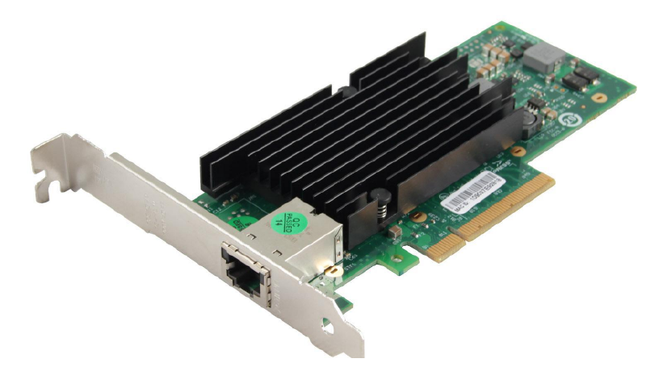
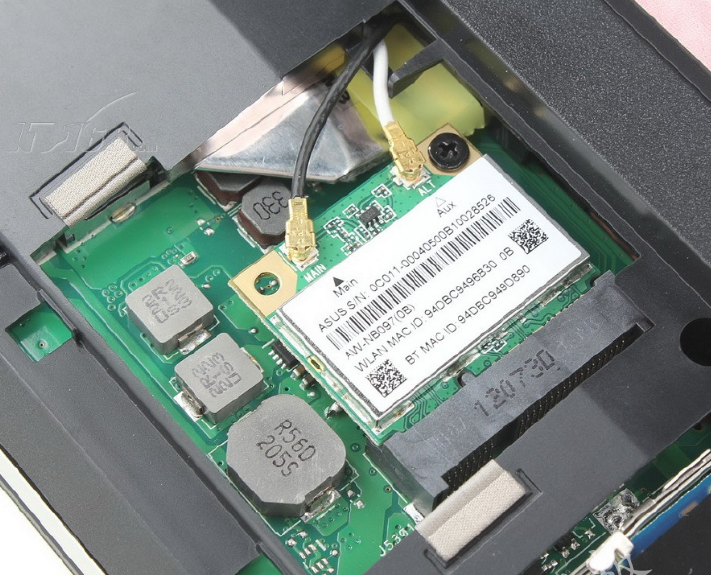
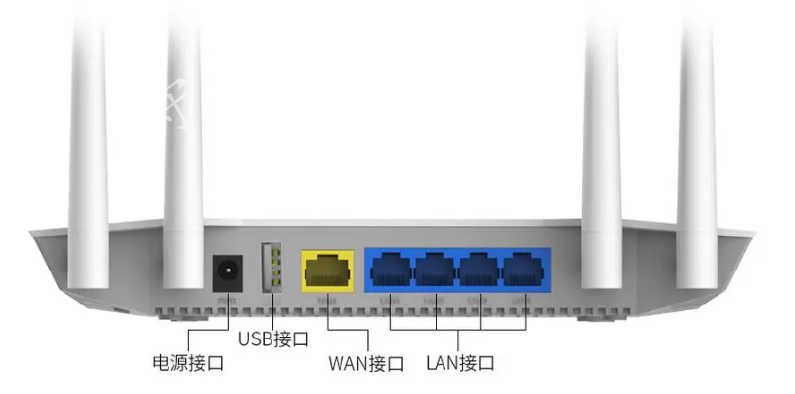
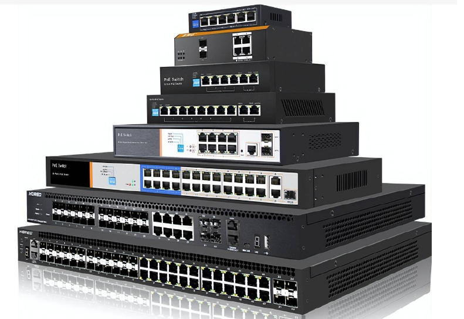
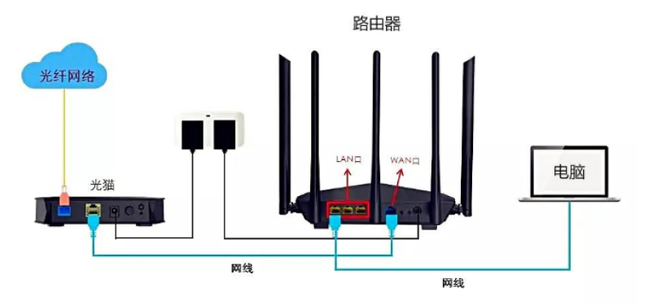
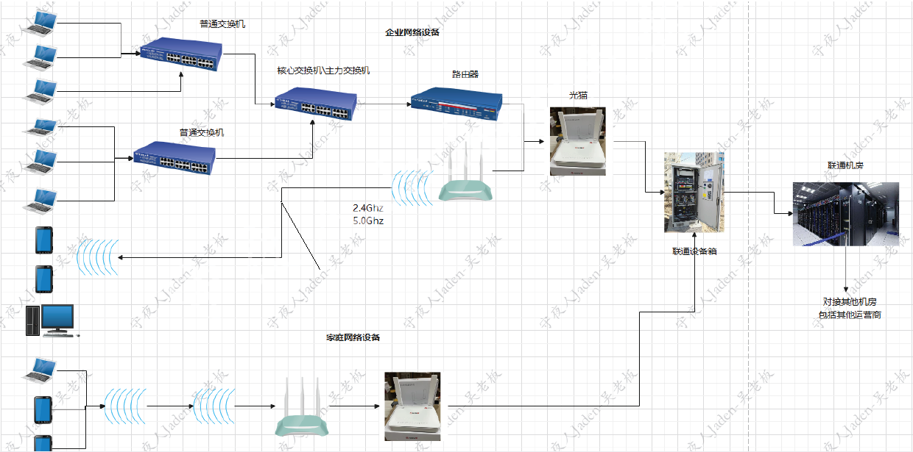
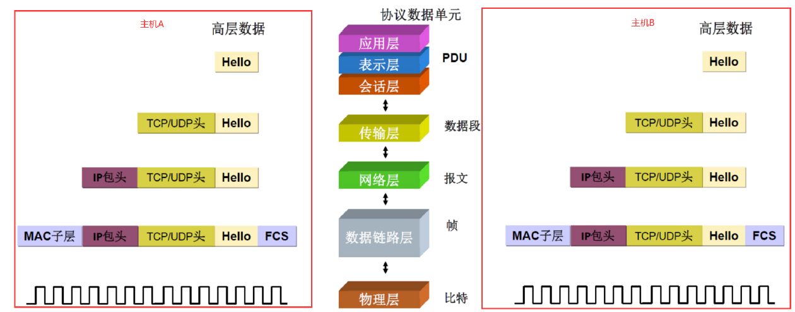
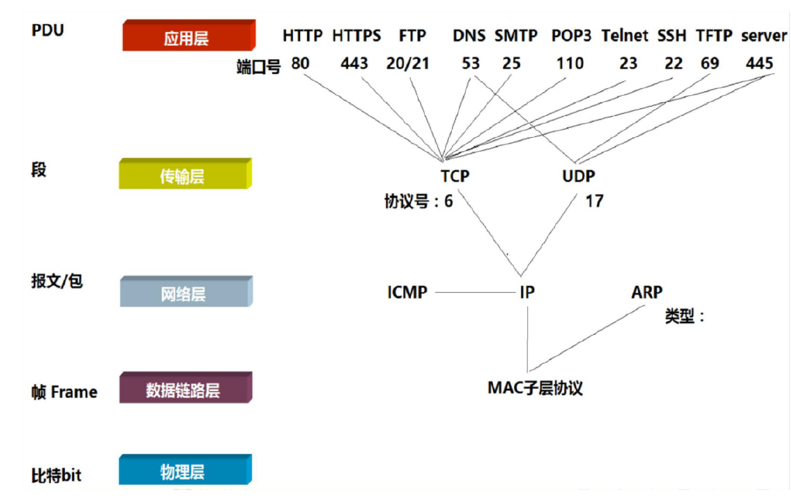

网络设备
多数笔记本都是有两种网卡，有线网卡和无线网卡，手机内置无线网卡。
有线网卡：

无线网卡：

路由器

交换机

光猫

光 转换成 电 传输

运营商 提供网络服务的供应商 如中国移动、中国联通、中国电信、 中国广电等

生产商 通信设备的生产厂家 如华为、中兴、诺基亚、爱立信等

为了确保网络能够正常运行定义了许多规则集，即协议（Protocol），它们是网络通信的基础。

协议：经过各方协商一致后确定的规则，用于规范网络中的数据交换过程。遵循相同的协议，不同设备和系统间就能顺利地进行数据交互。
通用协议：一些关键协议被全球广泛接受和使用，例如TCP/IP、HTTP等，它们构成了互联网通信的基础架构，确保了跨地域、跨平台的信息交流。
私有协议：此外，某些组织或企业会根据自身需求设计内部使用的协议，即私有协议。这类协议通常用于特定场景下的优化或安全增强。

osi 7层模型

1、物理层
物理层 ：解决信号转换的问题，基本都是数字信号，二进制数据控制的电路信号、电磁信号：电信号、
光纤(光信号：光纤网卡可以将电信号转换为光信号)、电磁波。这个基本不需要我们关注，设备厂商就帮
我们解决了。
2、数据链接层
每块网卡(有线、无线、蓝牙等)每块网卡出厂时都被烧制上一个世界唯一的mac地址，长度为48位2进
制，通常由12位16进制数表示（前六位是厂商编号，后六位是流水线号），通过mac地址就可以查询到
它对应的厂商。这个mac地址是入网许可证，没有mac地址，就不能上网。

3、网络层
网络层，主要是用来封装ip地址的，公网ip全世界唯一，私网ip(也叫做内网ip)。

4、传输层
传输方式tcp/udp，发送数据包的方式，比如发快递：空运、货车、火车等等。

5、应用层
5.1 会话层
会话层会发送一个探测数据包，探测双方网络是否能互通。会话的建立和断开都是由这一层的数据控制
的。
5.2 表示层
用来描述文件的类型，比如我们在网上发送了一个图片、文本、视频等等格式。表示层会在发送的整体
二进制数据前面加上文件类型数据标记。数据加密、数据格式声明的数据都是在这一层。
5.3 应用层
就是我们各类应用软件了，qq、浏览器、微信、网易云等等。
tcp/ip五层协议是用到额最广泛的，只要大家电脑上安装了这个协议，就可以基于这个协议来进行通信
了。
tcp/ip协议栈分为5层协议。应用层(会话层、表示层和应用层这三层合并为了一层)、传输层、网络层、
数据链路层、物理层。
