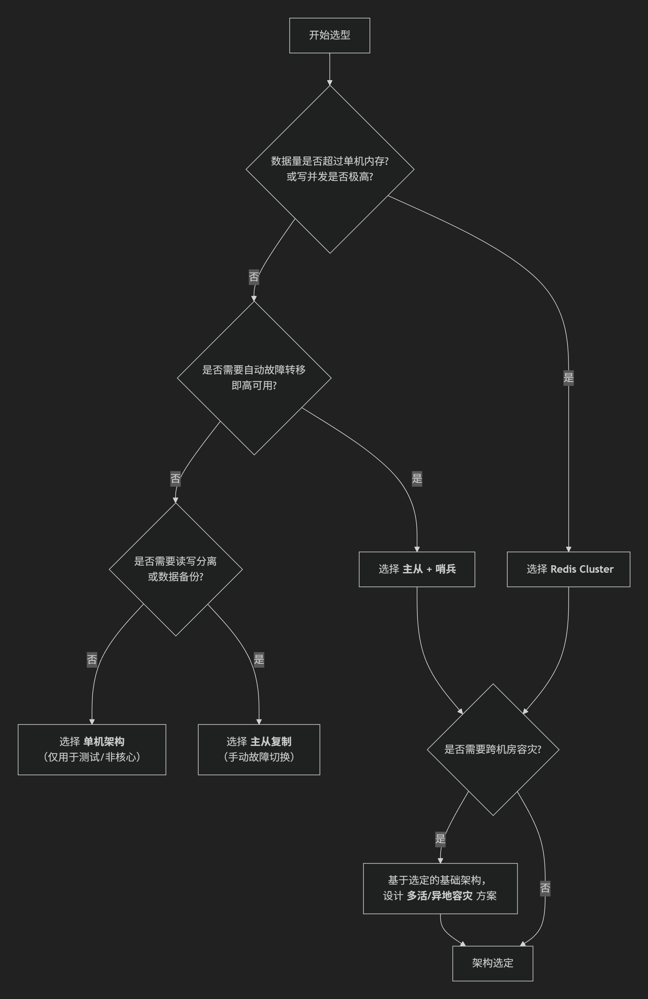

redis架构选型思路



### **核心架构模式对比**

| 架构模式             | 核心原理                                                     | 优点                                                         | 缺点                                                         | 典型适用场景                                                 |
| -------------------- | ------------------------------------------------------------ | ------------------------------------------------------------ | ------------------------------------------------------------ | ------------------------------------------------------------ |
| **1. 单机架构**      | 单个 Redis 实例，无冗余。                                    | 部署简单，成本最低，维护方便。                               | 单点故障，性能与容量受单机限制。                             | 开发测试、非核心业务缓存、极低流量应用。                     |
| **2. 主从复制**      | 一主多从，主写从读，数据异步复制。                           | 读写分离提升读性能，数据有多个副本。                         | 主节点是单点，故障需手动切换；写能力未扩展。                 | 读多写少，对读性能要求高，可容忍分钟级故障恢复。             |
| **3. 哨兵模式**      | 在主从基础上，引入 Sentinel 进程监控与自动故障转移。         | **实现了高可用**，自动主从切换，客户端可感知。               | 写性能和存储容量仍受单主节点限制；配置稍复杂。               | **通用高可用方案**，适用于多数对可用性有要求的业务（如会话缓存、消息队列）。 |
| **4. 集群模式**      | 官方方案。数据分片（16384个槽），多主多从，每个分片主从配对，内置故障转移。 | **高性能、高可用、可扩展**。支持海量数据与高并发，自动分片与故障转移。 | 客户端需支持集群协议；跨节点操作受限（如事务、Lua脚本）；扩缩容需迁移槽。 | **大数据量、高并发**场景。如大型电商首页缓存、社交平台热数据、实时排行榜。 |
| **5. 代理分片**      | 通过中间件（如 Codis, Twemproxy）代理，对客户端透明地分片到多个 Redis 实例。 | 对客户端友好，支持平滑扩缩容（Codis）。                      | 引入代理层，增加延迟和运维复杂度；代理可能成为瓶颈或单点。   | 历史遗留项目升级，或客户端不支持集群协议时。目前更推荐原生集群模式。 |
| **6. 多活/异地容灾** | 在哨兵或集群基础上，跨数据中心部署，通过异步复制保持数据同步。 | 提供机房级容灾能力，支持就近读写。                           |                                                              |                                                              |

经典配置

```
# ==================== 网络配置 ====================
# 绑定地址：本地 + 指定内网 IP + IPv6
bind 127.0.0.1 172.17.79.248 -::1
# 保护模式：启用
protected-mode yes
# Redis 服务端口
port 6379
# TCP 连接队列长度
tcp-backlog 511
# 客户端超时时间（0 表示不超时）
timeout 0
# TCP keepalive 检测间隔（秒）
tcp-keepalive 300

# ==================== 进程配置 ====================
# 后台运行模式
daemonize yes
# PID 文件路径
pidfile /run/redis/redis-server.pid
# 日志级别：notice
loglevel notice
# 日志文件路径
logfile /var/log/redis/redis-server.log

# ==================== 数据库配置 ====================
# 数据库数量
databases 16
# RDB 快照文件名
dbfilename dump.rdb
# 数据目录
dir /var/lib/redis

# ==================== RDB 持久化 ====================
# 快照触发： 多少秒内 插入次数
save 900 5 300 50 60 500
# RDB 保存失败时停止写入
stop-writes-on-bgsave-error yes
# RDB 文件压缩
rdbcompression yes
# RDB 文件校验和
rdbchecksum yes

# ==================== AOF 持久化 ====================
# 启用 AOF 持久化
appendonly yes
# AOF 文件名
appendfilename "appendonly.aof"
# AOF 目录名
appenddirname "appendonlydir"
# AOF 同步策略：每秒同步
appendfsync everysec
# AOF 重写触发条件（增长 100%）
auto-aof-rewrite-percentage 100
# AOF 重写最小文件大小
auto-aof-rewrite-min-size 64mb

# ==================== 安全配置 ====================
# 访问密码（建议生产环境修改为强密码）
requirepass root

# ==================== 复制配置 ====================
# 从节点数据过期时仍提供服务
replica-serve-stale-data yes
# 从节点只读
replica-read-only yes
# 从节点优先级（用于哨兵选举）
replica-priority 100

# ==================== 内存优化 ====================
# 惰性删除：淘汰键
lazyfree-lazy-eviction no
# 惰性删除：过期键
lazyfree-lazy-expire no
# 惰性删除：服务端删除
lazyfree-lazy-server-del no
# 禁用透明大页（提升性能）
disable-thp yes

# ==================== 性能监控 ====================
# 慢查询阈值（微秒）
slowlog-log-slower-than 10000
# 慢查询日志最大长度
slowlog-max-len 128
# 延迟监控阈值（0 表示禁用）
latency-monitor-threshold 0

# ==================== 客户端配置 ====================
# 普通客户端输出缓冲区限制
client-output-buffer-limit normal 0 0 0
# 从节点客户端缓冲区限制
client-output-buffer-limit replica 256mb 64mb 60
# 发布订阅客户端缓冲区限制
client-output-buffer-limit pubsub 32mb 8mb 60

# ==================== 其他配置 ====================
# 内部任务执行频率
hz 10
# 启用主动重新哈希
activerehashing yes
# jemalloc 后台线程
jemalloc-bg-thread yes

```

